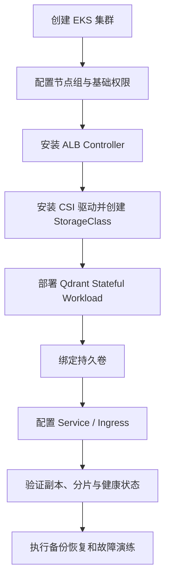
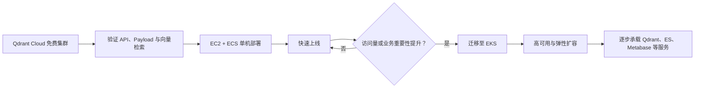

# 相似题服务部署计划

## 背景

相似题服务依赖 Qdrant 等基础设施。业务早期更看重研究和上线速度，访问量增长后则需要解决单点故障和可用性问题。

## 演进方案

### 验证阶段：托管集群

在正式准备基础设施之前，可以先创建 Qdrant Cloud 免费集群，记录集群地址和 API Key，并通过官方教程验证：

- 客户端能否正常连接集群。
- Collection、向量和 payload 的数据模型是否符合方案。
- payload 过滤与向量召回能否组合工作。
- 相似题的导入和查询代码是否能够跑通。

这一阶段只用于技术验证。API Key 不应写入代码或文档，应通过环境变量或密钥管理服务注入。

### 第一阶段：单机快速上线

使用 `EC2 + ECS` 单机部署。

- 优点：方案简单，部署和验证速度快。
- 缺点：存在单点故障（SPOF）。
- 适用阶段：业务前期、研究验证和低访问量阶段。

### 第二阶段：EKS 集群化

当业务访问量或重要性提升后，迁移到 EKS。

- 获得集群化部署和高可用能力。
- 为后续扩容和故障恢复提供基础。
- Elasticsearch、Metabase 等相关服务也可以逐步纳入集群。

## Qdrant 集群部署顺序

Qdrant 属于有状态服务。部署到 EKS 时，需要先准备集群基础设施，再部署数据库本身：

1. 创建并验证 EKS 集群。
2. 安装和配置 ALB Controller，提供外部或内部访问入口。
3. 安装存储驱动并准备 StorageClass。
4. 部署 Qdrant 集群及持久卷。
5. 验证副本、分片、网络和数据恢复。

### ALB 与访问边界

- 优先通过内部负载均衡向业务服务暴露 Qdrant。
- 不应将管理端口或未认证接口直接暴露到公网。
- 健康检查需要区分进程存活与节点可接受查询的就绪状态。
- 网络策略和安全组只允许必要的应用服务访问。

### StorageClass 与持久化

- Qdrant Pod 重建后必须重新挂载原有数据卷。
- StorageClass 的回收策略需要与数据保留要求一致。
- 不应把数据库数据只写入容器临时文件系统。
- 扩容节点或迁移可用区前，应验证卷的绑定模式和可调度性。
- 升级、缩容和故障恢复前必须确认副本与备份状态。

### 上线检查

- 所有节点和 Collection 状态正常。
- 写入、过滤和向量检索通过业务样例验证。
- Pod 重启后数据仍然存在。
- 单节点或单 Pod 故障不会让服务整体不可用。
- 监控覆盖磁盘、内存、请求延迟、错误率和集群状态。
- 已进行备份恢复演练，而不只是确认备份任务成功。

## 核心流程

## 核心判断

先接受可控的单点风险换取验证速度，不在业务早期过度建设；但把 EKS 作为明确的演进方向，在流量和重要性达到阈值后及时迁移。

## 来源

- 飞书路径：`技术 / 算法 / AI组题 / 相似题 / 部署计划`
- 作者：罗浩远
- 最近修改：2025-11-26
- 补充材料：`技术 / 算法 / AI组题 / 相似题 / Qdrant入门`
- 补充材料：`技术 / 算法 / AI组题 / 相似题 / 部署计划 / Qdrant集群部署`
