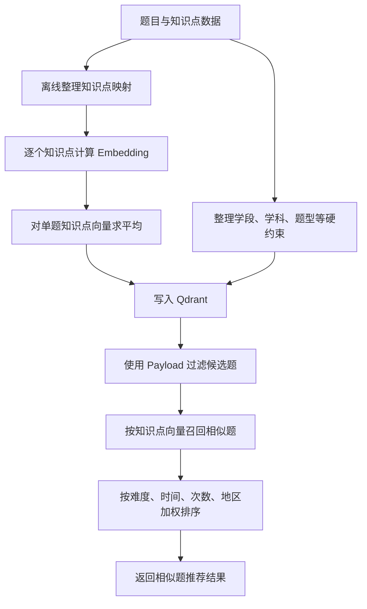

# 相似题推荐

## 背景与目标

为人工选题提供相似题推荐。推荐结果既要在语义和知识点上接近目标题目，也要满足学段、学科、题型等业务硬约束，并兼顾难度、地区、使用次数和更新时间等偏好。

## 核心思路

方案将条件分成三类，避免把不同性质的约束全部塞进向量相似度：

| 类型 | 字段示例 | 处理方式 |
| --- | --- | --- |
| 必须满足 | 是否待定、学段、学科、题型 | 使用 Qdrant payload 过滤 |
| 语义相关 | 知识点 | 生成向量并进行相似度召回 |
| 排序偏好 | 难易度、更新时间、使用次数、地区 | 召回后再次加权排序或取样 |

### 知识点向量

知识点存在层级映射复杂、单题关联数量多等问题，不适合直接拼成一段文本统一计算。

设计采用以下方式：

1. 离线维护知识点映射。
2. 每个知识点单独计算 embedding。
3. 取一道题关联的全部知识点向量。
4. 对这些向量求平均，得到题目的知识点总向量。
5. 将总向量与必须满足的 payload 字段一起导入 Qdrant。

## 核心流程

## 关键设计判断

- **过滤与相似度分离**：业务硬约束必须精确满足，不能依赖向量相似度碰运气。
- **召回与排序分离**：向量数据库负责缩小候选范围，业务偏好在第二阶段处理。
- **知识点独立向量化**：降低知识点数量和层级变化带来的文本拼接噪声。
- **选用 Qdrant**：在 Qdrant 与 Milvus 之间选择 Qdrant，利用其向量搜索和 payload 过滤能力。

## 经验总结

相似题并不是单纯的向量检索问题，而是“结构化过滤 + 语义召回 + 业务重排”的多阶段推荐问题。先明确字段属于硬约束、相关性还是偏好，再选择实现位置，能显著降低后续调参和维护成本。

## 来源

- 飞书路径：`技术 / 算法 / AI组题 / 相似题`
- 作者：罗浩远
- 最近修改：2025-12-01
