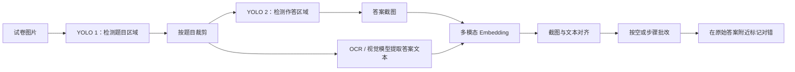

# 点拨版学生答案留痕

## 背景

点拨版需要在批改结果附近展示学生的原始答案，并标记对错。学生答案可以采用两种展示形式：

- YOLO 裁剪出的原始作答截图。
- 视觉大模型或 OCR 提取出的文字答案。

相比只展示结构化批改结论，保留原始截图更便于学生和教师核对，也能帮助研发人员定位错误来自检测、转写、答案关联还是批改判断。

## 核心问题

方案需要解决两个关键问题：

1. 提取出的答案数量能否与答案截图数量稳定对齐。
2. 大题的作答截图是否准确，以及截图能否与对应题目框关联。

如果答案截图与文本没有可靠的一一对应关系，即使批改结论正确，也可能展示到错误的题目或空位附近。

## 整体方案

使用两个 YOLO 模型分层检测：

1. 模型一检测试卷中的题目区域。
2. 模型二在题目区域内继续检测学生答案，包括填空答案和解答题答案。
3. 填空题按空拆分批改结果，分别展示原始答案并标记对错。
4. 使用多模态 embedding，将答案截图与提取出的答案文本进行匹配。



## Embedding 对齐实验

实验使用豆包多模态 embedding 模型：

- 分别计算答案截图和答案文本的向量。
- 使用余弦相似度衡量截图与文本的匹配程度。
- 每张图片选择相似度最高的答案文本。
- 当同一答案文本匹配到多张图片时，只保留相似度最高的图片，其余图片舍弃。

这一方案可以把视觉检测结果与文字提取结果连接起来，但当前规则属于局部贪心匹配，不能保证全局最优的一一对应。

## 已发现的问题

多空填空题中容易发生错配。可能原因包括：

- 多个答案都很短，文本语义区分度不足。
- 相同数字、符号或表达式的 embedding 过于接近。
- 答案截图缺少题号、横线或上下文，模型难以判断它属于哪个空。
- 单独按最高余弦相似度匹配，没有利用页面顺序、题目归属和空间位置。
- 先按图片选文本、再去除重复图片的规则，可能牺牲整体匹配质量。

## 改进方向

### 先约束题目范围

答案截图和答案文本应先关联到同一个题目，只在题目内部进行匹配，避免跨题误配。第二个 YOLO 模型的检测结果需要继承父题目的坐标和题号。

### 融合空间与顺序信息

不能只依赖 embedding 相似度，可以构造综合匹配分数：

```text
score = embedding 相似度
      + 阅读顺序一致性
      + 空位序号一致性
      + 坐标距离约束
      + 题型与答案格式一致性
```

对于同一道多空题，优先按照从左到右、从上到下的顺序对齐，再使用 embedding 处理顺序不明确的情况。

### 使用全局一一匹配

将截图和文本构造成二分图，以综合分数作为边权，使用匈牙利算法等全局分配方法完成一一匹配。相比逐项选择最高相似度，这能减少多个截图争抢同一文本的问题。

### 保留低置信与未匹配结果

不应直接丢弃未匹配或重复匹配的图片。系统应保留：

- 匹配分数和候选项。
- 未匹配截图与未匹配文本。
- 原始题目框和答案框坐标。
- OCR 原始输出。

低于阈值的结果进入人工复核或采用题目整体截图兜底，避免为了强制一一对应而展示错误答案。

## 关键设计判断

- “留痕”不仅是前端展示需求，也是自动批改结果可追溯性的基础。
- 双 YOLO 可以建立“题目区域包含答案区域”的层级关系，降低跨题关联错误。
- Embedding 适合作为候选匹配信号，但不宜单独决定多空题的一一对应。
- 多空题应优先利用题目归属、版面坐标和阅读顺序，再结合语义相似度。
- 匹配失败时应保留原始产物并明确标记低置信，而不是静默舍弃截图。

## 来源

- 飞书文档：[点拨版留痕思考](https://forktech.feishu.cn/wiki/GpiNweIHciSxlEkxFjhc6wUCnIf)
- 飞书路径：`技术 / 算法 / 自动批改 / 点拨版留痕思考`
- 作者：罗浩远
- 最近修改：2025-06-27

