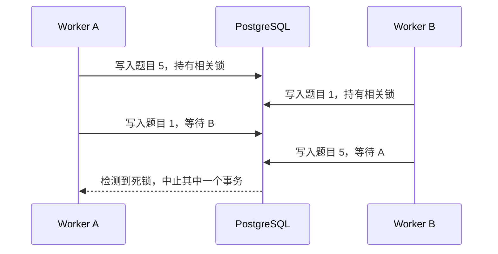

# 批改规则批量 UPSERT 死锁

## 故障现象

自动批改 Worker 向 PostgreSQL 表 `AutoGradingQuestionRules` 批量写入题目规则时，数据库报出 `DeadlockDetected`：

```text
Process 22276 waits for ShareLock on transaction 364071960;
blocked by process 22364.
Process 22364 waits for ShareLock on transaction 364071891;
blocked by process 22276.

CONTEXT: while inserting index tuple in relation
"AutoGradingQuestionRules"
```

写入语句使用复合唯一键执行 UPSERT：

```sql
INSERT INTO "AutoGradingQuestionRules" (
    "PaperType",
    "PaperId",
    "QuestionNumber",
    "QuestionSource",
    "QuestionId",
    "IsCrossPage",
    "Rule",
    "CreatedAt",
    "UpdatedAt"
)
VALUES (...)
ON CONFLICT ("PaperType", "PaperId", "QuestionNumber")
DO UPDATE SET
    "QuestionSource" = EXCLUDED."QuestionSource",
    "QuestionId" = EXCLUDED."QuestionId",
    "IsCrossPage" = EXCLUDED."IsCrossPage",
    "Rule" = EXCLUDED."Rule",
    "UpdatedAt" = NOW();
```

## 原因

原文对业务触发条件的描述很准确：

> 并发插入相同数据：多个 Worker 线程同时处理相同试卷（`Type=Work, PaperId=19171`）的同一道题目时，如果此前都没有生成批改规则，则可能两个 Worker 同时生成了批改规则，都在调用 `insert_question_rules` 方法插入数据库。

`ON CONFLICT ("PaperType", "PaperId", "QuestionNumber")` 在检查和更新冲突记录时需要等待其他事务。两个批次包含相同唯一键，但写入顺序不同，就可能形成循环等待：



关键不是单条 UPSERT 本身，而是并发事务以不同顺序取得同一组资源的锁。

## 最小复现实验

先创建测试表：

```sql
DROP TABLE IF EXISTS t;

CREATE TABLE t (
    id INT PRIMARY KEY,
    data TEXT
);
```

事务 A 先写 `id=5`，再写 `id=1`：

```sql
BEGIN;

INSERT INTO t VALUES (5, 'A') ON CONFLICT DO NOTHING;
SELECT pg_sleep(10);
INSERT INTO t VALUES (1, 'A') ON CONFLICT DO NOTHING;

COMMIT;
```

事务 B 采用相反顺序，先写 `id=1`，再写 `id=5`：

```sql
BEGIN;

INSERT INTO t VALUES (1, 'B') ON CONFLICT DO NOTHING;
SELECT pg_sleep(10);
INSERT INTO t VALUES (5, 'B') ON CONFLICT DO NOTHING;
INSERT INTO t VALUES (6, 'B') ON CONFLICT DO NOTHING;

COMMIT;
```

两个事务并发运行时：

1. A 持有 `id=5` 相关锁。
2. B 持有 `id=1` 相关锁。
3. A 等待 B 释放 `id=1`。
4. B 等待 A 释放 `id=5`。
5. PostgreSQL 检测到循环等待，并回滚其中一个事务。

死锁发生后，当前事务进入失败状态；必须先 `ROLLBACK`，事务 B 后续写入 `id=6` 的语句不能继续正常执行。

## 修复方案

### 固定批量写入顺序

所有 Worker 在写入前，统一按照冲突键排序：

```python
rules.sort(
    key=lambda rule: (
        rule["paper_type"],
        rule["paper_id"],
        rule["question_number"],
    )
)
```

这是本问题最直接的数据库侧修复。所有事务按照相同顺序获取锁，可以消除由批次乱序引起的大部分循环等待。

排序必须发生在真正发给数据库的参数列表上，不能只保证上游题目展示顺序。

### 阻止同一试卷被重复处理

如果业务不允许同一试卷同时生成两份批改规则，应在任务调度层建立幂等和互斥机制：

- 使用 `PaperType + PaperId` 作为任务幂等键。
- 同一试卷只允许一个规则生成任务处于 `running` 状态。
- 重复消息直接复用已有任务，或等待当前任务完成。
- Worker 领取任务时采用原子状态更新，避免先查询、后更新产生竞争。

这比单纯处理数据库死锁更接近根因，因为日志显示两个 Worker 正在重复处理同一份试卷。

### 缩短事务

- 在进入事务前完成模型调用、规则生成和数据整理。
- 事务内只保留排序后的数据库写入。
- 避免在事务期间执行网络请求、休眠或耗时计算。
- 数据量较大时按稳定顺序分批提交，但要明确批次失败后的业务一致性。

事务越短，锁重叠窗口越小。

### 对死锁进行有限重试

即使顺序统一，复杂并发系统仍可能出现其他死锁，因此应用需要捕获 PostgreSQL 死锁异常：

1. 回滚当前事务。
2. 进行带随机抖动的短暂退避。
3. 从完整事务边界重新执行。
4. 超过重试上限后记录任务、试卷和批次键，进入人工处理或死信队列。

不能在已经失败的事务中仅重试最后一条 SQL。

### 可选的试卷级数据库锁

在无法快速改造任务调度时，可以用基于 `PaperType + PaperId` 的 PostgreSQL advisory lock 串行化同一试卷的规则写入。它适合作为明确范围内的互斥手段，但必须确保：

- 锁键生成方式稳定且碰撞可控。
- 锁与事务生命周期绑定。
- 获取不到锁时有超时和重试策略。
- 不把不同试卷不必要地串行化。

## 建议实施顺序

1. 写入前按完整唯一键稳定排序。
2. 为同一试卷的规则生成任务增加幂等约束。
3. 缩短事务，只在事务内执行数据库操作。
4. 增加死锁事务级重试和监控。
5. 若重复并发仍无法从调度层消除，再引入试卷级 advisory lock。

## 监控与排查

建议在死锁日志中记录：

- `PaperType`、`PaperId` 和涉及的 `QuestionNumber`。
- Worker、任务和消息 ID。
- 批次写入键的实际顺序。
- 事务开始时间、持续时间和重试次数。
- PostgreSQL 异常类型及死锁详情。

还应统计同一试卷被多个 Worker 同时处理的次数。若这一指标持续出现，说明任务幂等问题仍未解决。

## 关键经验

- UPSERT 能解决唯一键冲突，但不能自动避免并发死锁。
- 批量写入相同资源时，所有事务必须遵循一致的锁获取顺序。
- PostgreSQL 通过中止事务解除死锁；应用必须回滚并从事务边界重试。
- 数据库重试是兜底，任务幂等和同一业务对象的并发控制才是更上游的修复。
- 线上故障笔记应保留真实异常、业务触发条件和最小复现实验，便于之后验证修复是否有效。

## 来源

- 飞书文档：[bug-数据库死锁](https://forktech.feishu.cn/wiki/HeLRw2SyIiovrmkGzjcc7PQInph)
- 飞书路径：`技术 / 算法 / 自动批改 / 线上问题 / bug-数据库死锁`
- 作者：罗浩远、欧荣意、杨阳
- 最近修改：2025-11-05

