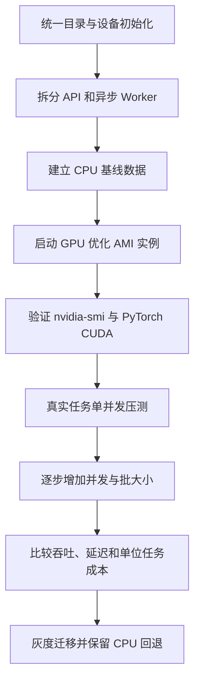

# 自动批改 GPU 上云

## 背景

自动批改服务需要执行 YOLO 等模型推理。原有 A100 环境的主机内存占用已经达到约 40 GB，而普通 8 核、32 GB 云服务器虽然可以运行任务，但 CPU 推理速度无法满足扩展需求。

原文给出的关键实测结论是：

> YOLO 步骤耗时约 6 min，且属于阻塞操作。

按单 Worker 串行估算，一小时只能处理约 10 个任务。继续增加 CPU Worker 会同步增加内存、进程和调度开销，因此文档最终将方案转向 GPU 实例。

## 上云前置工作

迁移基础设施之前，代码需要先解除对原有单机环境的隐式依赖：

1. 统一临时文件目录，避免不同机器、容器或 Worker 使用不一致的路径。
2. 统一 PyTorch 的 GPU/CPU 初始化逻辑，让运行设备由配置和环境决定。
3. 让管理端兼容新的任务部署方式。
4. 分离同步 API 与 Worker 异步任务，避免耗时推理阻塞接口进程。

这四项并不只是部署准备，也是在明确服务边界：API 负责接收和查询任务，Worker 负责消耗资源较重的模型计算。

## 机器选型

### 内存

原有 A100 机器未设置内存上限，观测到主机内存占用约 40 GB。文档据此提出暂时选择 32 GB 及以上规格。

这里的 32 GB 更接近最低候选值，而不是经过压测验证的安全容量。正式选型还应记录：

- 模型加载后的稳定 RSS。
- 单任务峰值内存。
- 并发任务的增量内存。
- 图片解码、临时数组和结果序列化的峰值。
- 操作系统、容器和监控组件的预留空间。

### CPU 还是 GPU

CPU 机器的优势是成本低、环境简单，但实测推理耗时使吞吐受限。原文的判断很直接：

> 效率低下，需要考虑使用 GPU 机器。

这个决策的核心不是“GPU 一定更快”，而是单位任务成本和目标吞吐量。至少应比较：

| 指标 | CPU 实例 | GPU 实例 |
| --- | --- | --- |
| 单任务总耗时 | 已知约 6 分钟用于 YOLO 步骤 | 待压测 |
| 每小时吞吐量 | 单 Worker 约 10 个任务 | 待压测 |
| 月度实例成本 | 基准 | 原文估算接近 CPU 的 10 倍 |
| 可承载并发 | 受 CPU 推理和内存限制 | 受显存、批处理和模型并发限制 |
| 运维复杂度 | 较低 | 需要驱动、CUDA、AMI 和 GPU 监控 |

文档中的成本截图显示，候选 GPU 机器月成本接近 CPU 机器的 10 倍，但作者认为当前扩展仍需要 GPU。更完整的决策应继续计算：

```text
单位任务成本 = 实例小时价格 / 每小时成功任务数
```

如果 GPU 实例的吞吐提升超过价格倍率，或者能够显著降低排队时间、超时率和人工扩容成本，GPU 方案仍可能更经济。

### GPU 实例

文档比较了 AWS `g5.xlarge` 与 `g5.2xlarge` 等规格。截图中两者都使用一张 NVIDIA A10G，主要差异在 vCPU 和主机内存：

| 实例 | GPU | GPU 显存 | vCPU | 主机内存 |
| --- | --- | ---: | ---: | ---: |
| `g5.xlarge` | 1 × A10G | 24 GiB | 4 | 16 GiB |
| `g5.2xlarge` | 1 × A10G | 24 GiB | 8 | 32 GiB |

由于服务已有较高主机内存占用，`g5.xlarge` 的 16 GiB 内存明显偏小；`g5.2xlarge` 更接近文档提出的最低内存要求。但在最终采购前，仍需用真实批改任务验证 32 GiB 是否足够。

## GPU 环境

### 使用 GPU 优化 AMI

GPU 实例需要驱动、CUDA 及容器运行时支持。原文选择 AWS ECS GPU 优化 AMI：

- [Amazon ECS-optimized AMI](https://docs.amazonaws.cn/AmazonECS/latest/developerguide/ecs-optimized_AMI.html)

使用官方 GPU 优化镜像可以减少手工安装驱动造成的版本不匹配，但仍应固定并记录：

- AMI ID 与发布时间。
- NVIDIA 驱动版本。
- CUDA 版本。
- PyTorch 及其 CUDA 构建版本。
- 容器基础镜像版本。

### 验证 GPU

实例启动后，先执行：

```bash
nvidia-smi
```

确认系统能识别 GPU，并检查驱动、CUDA、显存及运行进程。文档截图中的候选机器识别为 NVIDIA A10G，显存约 23 GB。

仅能执行 `nvidia-smi` 还不代表应用可正常推理。还应在服务运行环境中验证：

```python
import torch

print(torch.cuda.is_available())
print(torch.cuda.get_device_name(0))
```

随后使用真实模型完成一次加载和推理，避免宿主机驱动正常、容器内运行时却不可用。

## GPU 监控

原文建议安装 `nvtop`，便于实时观察 GPU 使用情况，并保留了源码编译过程：

```bash
sudo dnf groupinstall -y "Development Tools"
sudo dnf install -y cmake git gcc-c++ make
sudo dnf install -y ncurses-devel
sudo dnf install -y libdrm-devel systemd-devel
sudo dnf install -y nvidia-driver-devel

git clone https://github.com/Syllo/nvtop.git
cd nvtop
mkdir build && cd build
cmake ..
make -j"$(nproc)"
sudo make install
```

`nvtop` 适合人工排查，但生产环境还需要持续指标。建议采集：

- GPU 利用率。
- 显存已用量与峰值。
- GPU 温度和功耗。
- 单任务推理耗时。
- 任务队列长度和等待时间。
- 成功率、超时率和重试次数。
- CPU、主机内存和磁盘临时空间。

## 推荐实施顺序



1. 先完成代码层的 CPU/GPU 兼容和服务拆分。
2. 固定测试集，记录 CPU 环境的耗时、内存与成功率。
3. 使用 GPU 优化 AMI 启动候选实例。
4. 验证驱动、CUDA、PyTorch 和模型推理链路。
5. 从单任务开始压测，再逐步提高并发或批大小。
6. 以单位任务成本、P95 延迟和稳定性决定最终规格。
7. 灰度迁移 Worker，并保留 CPU Worker 作为短期回退路径。

## 文档中的亮点

- 从真实任务耗时出发，而不是仅凭模型类型决定是否使用 GPU。
- 同时考虑主机内存和 GPU 显存，没有把“有 GPU”当成唯一选型条件。
- 注意到 GPU 实例需要专用 AMI、驱动验证和运行监控。
- 明确记录了 GPU 方案价格显著更高，没有回避扩展能力与成本之间的取舍。

## 尚需补齐

- GPU 环境下的单任务耗时和每小时吞吐量。
- 不同并发数、批大小下的显存与主机内存峰值。
- CPU 与 GPU 的单位任务成本对比。
- 任务失败、GPU OOM 和驱动异常时的回退机制。
- 实例扩缩容策略，以及 Worker 停机时的任务重投规则。
- AMI、驱动、CUDA 和 PyTorch 的版本锁定方式。
- 上云后的最终机型、实际费用及稳定运行数据。

## 关键经验

- GPU 上云首先是应用架构问题，其次才是购买机器。
- 实例价格不能单独用于决策，应比较吞吐、延迟和单位任务成本。
- 主机内存与 GPU 显存是两套独立约束，选型时必须同时压测。
- `nvidia-smi` 是基础验收，不是应用链路验收。
- `nvtop` 适合现场观察，长期运行仍需要可查询、可告警的监控指标。

## 来源

- 飞书文档：[GPU上云](https://forktech.feishu.cn/wiki/OHxTw5ZgHiR1l3kfUB7ckPY5nEh)
- 飞书路径：`技术 / 算法 / 自动批改 / 疑难 / GPU上云`
- 作者：罗浩远
- 最近修改：2025-10-17

