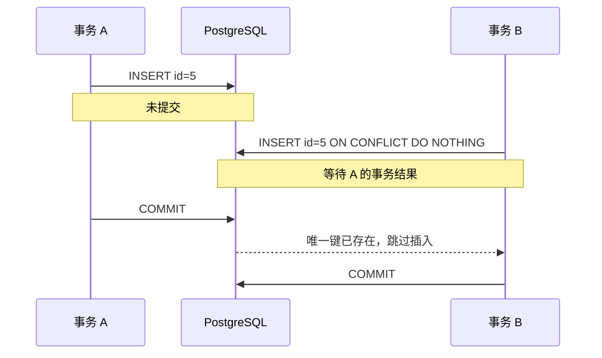
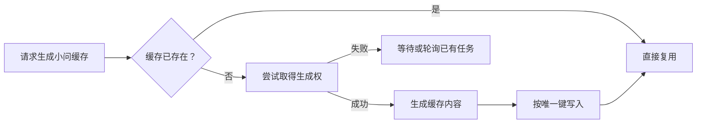

# PostgreSQL 并发插入与唯一约束

## 问题来源

自动批改的小问缓存需要并发写入数据库。假设两个事务分别批量插入：

- 事务 A：`1、2、4、5、6`
- 事务 B：`1、3、5、7`

重复 ID 采用 `ON CONFLICT DO NOTHING` 跳过。需要明确的问题是：当 B 尝试插入 `id=5` 时，A 已经插入相同 ID 但尚未提交，PostgreSQL 会如何处理？

原文准确指出了问题本质：

> 这是一个非常经典的并发插入 + 唯一约束冲突场景，涉及 PostgreSQL 的隔离级别和唯一约束的可见性语义。

## 实际行为

在默认的 `READ COMMITTED` 隔离级别下：

1. A 插入 `id=5`，但暂不提交。
2. B 尝试插入相同的唯一键。
3. B 不能立即确认 A 最终会提交还是回滚，因此通常等待 A 结束。
4. 如果 A 提交，B 确认唯一键冲突并执行 `DO NOTHING`。
5. 如果 A 回滚，B 可以继续完成自己的插入。



因此，原文实验中下面这句注释需要修正：

```sql
INSERT INTO t VALUES (5, 'B')
ON CONFLICT DO NOTHING; -- 原注释：立即返回，但没插入
```

更准确的描述是：

```sql
INSERT INTO t VALUES (5, 'B')
ON CONFLICT DO NOTHING; -- 等待 A 结束；A 提交后跳过插入
```

## 复现实验

创建测试表：

```sql
CREATE TABLE t (
    id INT PRIMARY KEY,
    data TEXT
);
```

Session A：

```sql
BEGIN;

INSERT INTO t VALUES (5, 'A')
ON CONFLICT DO NOTHING;

-- 暂不提交
```

Session B：

```sql
BEGIN;

INSERT INTO t VALUES (5, 'B')
ON CONFLICT DO NOTHING;

COMMIT;
```

此时 B 的 `INSERT` 会等待。然后在 A 中执行：

```sql
COMMIT;
```

B 随后结束等待，并因为冲突而不插入。查询结果为：

```sql
SELECT * FROM t;

--  id | data
-- ----+------
--   5 | A
```

如果 A 改为执行 `ROLLBACK`，B 则能够插入 `(5, 'B')`。

## 为什么“看不见”仍会等待

在 `READ COMMITTED` 下，一条普通查询通常看不到其他事务尚未提交的行。但唯一约束不能只依据当前查询快照判断，否则两个事务都可能成功插入相同唯一键。

可以把这里分成两个层面：

- **MVCC 查询可见性**：决定当前语句读取数据时能看到哪些行版本。
- **唯一索引一致性**：必须考虑其他并发事务尚未完成的冲突插入。

`ON CONFLICT DO NOTHING` 的唯一性检查可能因为另一个尚不可见的事务而等待，随后跳过一行，而这行在当前语句的 MVCC 快照中未必可由普通 `SELECT` 看到。

这不是语义矛盾，而是 PostgreSQL 为同时保证并发性能和唯一约束正确性采取的处理方式。

## 多行批量写入

对于 A 和 B 各自包含多个 ID 的场景，每个冲突键都可能产生等待。最终结果取决于：

- 两个事务实际处理键的顺序。
- 先遇到冲突的是哪个键。
- 对方事务最终提交还是回滚。
- 批次是否还形成了反向锁依赖。

如果两个事务采用不同顺序处理相同键，例如 A 先处理 `1` 再处理 `5`，B 先处理 `5` 再处理 `1`，就可能从单向等待升级为死锁。相关案例见[批改规则批量 UPSERT 死锁](./database-deadlock.md)。

## `DO NOTHING` 与 `DO UPDATE`

两种冲突策略都可能等待并发事务，但业务含义不同：

### `DO NOTHING`

- 冲突时不修改已有行。
- 适合“先写入者生效”或缓存已存在即可的场景。
- 调用方需要知道本次是否真的插入。

可以使用 `RETURNING` 判断：

```sql
INSERT INTO t (id, data)
VALUES (5, 'B')
ON CONFLICT DO NOTHING
RETURNING id;
```

返回一行表示成功插入；返回空结果表示因为冲突而跳过。

### `DO UPDATE`

- 冲突时更新已存在的行。
- 适合最新值应覆盖旧值的场景。
- 并发下会锁定并更新冲突记录，需要定义清楚覆盖规则。

不能仅为了拿到冲突行而执行无意义更新，这会产生额外行版本、锁竞争和触发器副作用。

## 对小问缓存的设计建议

### 明确缓存写入语义

首先确定业务需要哪一种：

- **首个结果生效**：使用 `DO NOTHING`，其他 Worker 复用已生成结果。
- **最新结果覆盖**：使用 `DO UPDATE`，并定义版本或时间比较规则。
- **只有一个 Worker 可以生成**：在任务层先取得所有权，避免重复计算。

数据库唯一键只能保证最终没有重复记录，不能避免多个 Worker 重复执行昂贵的模型计算。

### 使用数据库返回值

不要仅凭 SQL 没报错就认为写入成功。使用 `RETURNING` 或检查受影响行数，区分：

- 当前事务成功插入。
- 因冲突跳过。
- 因并发事务等待后跳过。

### 统一写入顺序

多行批次在进入数据库前按唯一键稳定排序。这样可以降低多个事务交叉等待并形成死锁的概率。

### 设置等待边界

业务不能无限等待时，可以配置适当的：

- `lock_timeout`
- `statement_timeout`

超时后必须回滚事务，并根据任务幂等性决定是否重试。超时是止损机制，不是并发一致性的替代方案。

### 减少重复计算

小问缓存的更优流程通常是：



查询后再插入仍存在竞争窗口，因此“取得生成权”必须通过原子状态更新、唯一任务记录或明确的锁机制实现。

## 与隔离级别的关系

提升隔离级别不会让唯一键冲突消失：

- `READ COMMITTED`：每条语句取得新快照，是默认且常见的运行方式。
- `REPEATABLE READ`：事务内保持一致快照，并发冲突可能表现为序列化失败。
- `SERIALIZABLE`：提供更强的串行化语义，但应用必须准备重试事务。

隔离级别决定可见性和异常形式，不替代业务幂等、稳定锁顺序与事务重试。

## 关键经验

- 其他事务未提交的行对普通查询不可见，但仍能参与唯一约束冲突判断。
- 并发 UPSERT 遇到未决冲突时，通常先等待对方事务提交或回滚。
- `DO NOTHING` 表示冲突后跳过，不表示不等待。
- 单向等待是正常并发控制；多个事务反向等待相同资源才会形成死锁。
- 数据库唯一约束负责最终一致性，任务层仍需解决重复计算和处理所有权。

## 来源

- 飞书文档：[pgsql数据库事务问题：拓展](https://forktech.feishu.cn/wiki/SRsswF1TOi41m7kGFtXcJElhnkF)
- 飞书路径：`技术 / 算法 / 自动批改 / 疑难 / pgsql数据库事务问题：拓展`
- 作者：罗浩远
- 最近修改：2025-10-24

