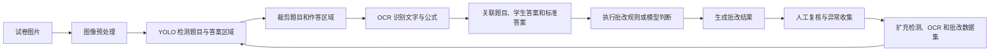
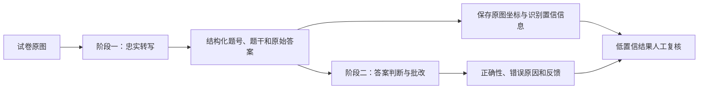
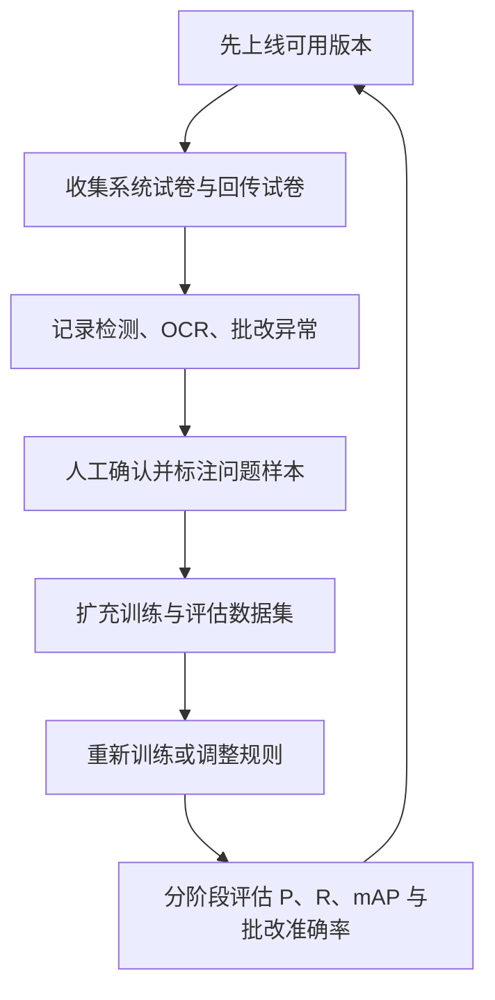
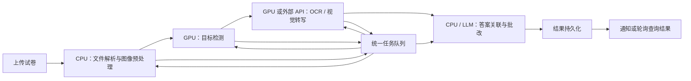

# 自动批改流程思考

## 背景与目标

自动批改需要从学生上传或系统回传的试卷中识别题目和答案，再结合标准答案判断作答结果。系统效果并不只取决于单个模型，而是由目标检测、OCR、答案匹配和批改规则等多个环节共同决定。

## 核心流程

## 四类核心难题

### 目标检测准确率

使用 YOLO 识别题目和答案区域，需要持续观察：

- Precision（P）
- Recall（R）
- mAP

当前题目区域的识别准确率较高，但学生答案区域的识别准确率相对较低。后者会直接影响 OCR 输入质量和最终批改结果。

### OCR 识别可靠性

OCR 阶段不只是普通文字识别，还包含公式、特殊字体和手写内容，主要风险包括：

- 模型自行补全公式计算结果。
- 模型根据上下文“脑补”正确答案，而非忠实转写。
- 特殊字体或书写风格识别错误。

因此 OCR 输出不能直接视为事实，需要保留原始图片并建立异常检测或人工复核机制。

## 视觉大模型实验

使用视觉大模型处理试卷时，模型在文档结构理解方面表现较好：

- 能识别试卷是否存在跨页。
- 能按顺序输出全部题号。
- 能提取完整题干。
- 能识别连写、倾斜等质量较差的手写答案。
- 跨页距离较大时，仍能按题目顺序组织答案。

但实验也暴露了生成式模型用于 OCR 的关键风险：当提示词告诉模型“学生答案可能有错误”时，模型可能主动纠正它认为不合理的数字。例如原图写的是一个数值，模型会依据计算或语义推断改成另一个“更合理”的值。

这说明模型的理解能力越强，并不代表它越适合直接承担忠实转写任务。

### 提示词职责隔离

转写与批改应使用不同阶段、不同提示词：

阶段一的提示词应明确：

- 只转写图片中实际出现的内容。
- 不计算、不补全、不纠错。
- 无法确认的字符使用统一占位符。
- 保持题号、跨页和答案顺序。

阶段二才允许结合标准答案进行推理和纠错。这样可以保留可追溯的原始识别结果，也能判断错误来自视觉识别还是批改逻辑。

### 批改准确率

批改阶段包含一系列细分问题：

- 部分题型必须取得标准答案后才能正确批改。
- 图片形式的答案难以直接修改或结构化。
- 上游检测或 OCR 的错误会在批改阶段继续放大。

评估最终效果时，应同时记录各阶段结果，避免只用最终正确率判断问题来源。

### 真实场景数据不足

模型优化依赖真实批改场景的数据。早期可以先使用系统内已有试卷和部分回传试卷，但仍需先上线可用功能，持续收集更多真实样本扩充数据集。

## 数据闭环

## 工程化拆分

从自动批改目录中的运行时间、重试、GPU、并发量和步骤分离等问题可以看出，生产系统不适合把全部步骤放在一个同步请求中完成。

建议按资源类型拆分任务：

这种拆分带来几项直接收益：

- GPU 步骤可以独立扩缩容，避免 CPU 任务占用昂贵实例。
- 单个阶段失败时只重试该阶段，不必重新运行整张试卷。
- 可以分别统计每个阶段的运行时间、队列等待和错误率。
- 外部模型 API 限流时，可以通过队列削峰而不是阻塞入口请求。
- 不同学校、批次或任务类型可以设置优先级和并发配额。

### 任务状态

每个阶段至少记录：

- `pending`：等待执行。
- `running`：Worker 已领取。
- `succeeded`：阶段结果已持久化。
- `retrying`：可恢复错误，等待重试。
- `failed`：超过重试上限，需要人工处理。

阶段结果应具有幂等写入键。Worker 重复消费同一消息时，不能生成重复批改记录。

### 重试原则

- 网络超时、临时限流和 Worker 中断可以指数退避重试。
- 输入格式错误、模型不支持的内容等确定性错误不应无限重试。
- 重试次数、最后错误和下一次执行时间需要持久化。
- 超过阈值的任务进入死信队列，并保留原始输入和阶段产物。

### 并发与容量

并发量不能只按 HTTP 请求数估算，应分别测量：

- 每页或每题在各阶段的平均耗时与高分位耗时。
- 单个 GPU Worker 同时执行任务时的显存和吞吐。
- 外部模型服务的速率限制。
- 队列长度、等待时间和任务完成时限。

扩缩容指标优先使用队列积压和任务等待时间。仅根据 CPU 利用率扩容，可能无法反映 GPU 或外部 API 阶段的真实瓶颈。

> 飞书目录存在“运行时间说明”“重试任务”“GPU上云”“并发量说明”“GPU步骤分离”等子文档，但本次页面未能加载其正文。本节仅整理从已确认问题域推导出的通用工程准则，不包含未经核验的业务参数。

## 关键设计判断

- 自动批改应被视为多阶段流水线，不能只优化最终的大模型判断。
- 必须保留阶段性指标，才能判断问题出在检测、OCR 还是批改逻辑。
- 真实数据不足时，产品上线和数据收集本身就是算法建设的一部分。
- 对公式和答案等高风险 OCR 内容，应优先追求忠实转写，而不是语言模型式的合理补全。
- 将视觉转写和答案判断拆成两个模型调用阶段，避免提示词互相污染。
- 按 CPU、GPU 和外部 API 资源边界拆分异步任务，以队列等待和阶段耗时指导扩缩容。

## 来源

- 飞书路径：`技术 / 算法 / 自动批改 / 自动批改流程思考`
- 补充材料：`技术 / 算法 / 自动批改 / 调研 / 大模型使用尝试`
- 工程问题目录：`运行时间说明 / 重试任务 / GPU上云 / 并发量说明 / GPU步骤分离`
- 作者：罗浩远
- 最近修改：2025-06-16
