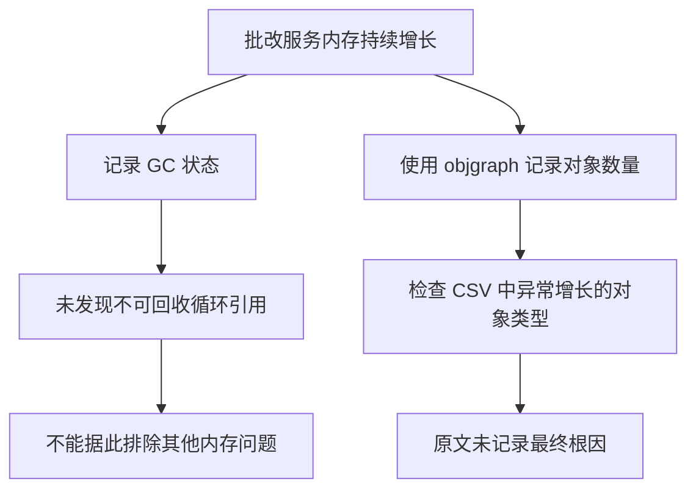

# Python 批改服务内存持续增长排查

## 背景

线上自动批改服务出现内存持续增长，最终需要重启服务恢复。原文将问题称为“内存泄漏”，但截至文档最后一次更新，已有证据只能确认进程内存持续上涨，尚未定位具体泄漏对象或完成根因验证。

这个区别很重要：进程 RSS 持续增长可能来自 Python 对象未释放，也可能来自 PyTorch 张量、CUDA 缓存、原生扩展、内存分配器不归还操作系统，或业务缓存无上限增长。

## 原始排查过程

### 工具选择

原文比较了几类 Python 内存分析工具：

- `objgraph`：在代码中统计对象数量及引用关系。
- `pympler`：提供对象和堆内存分析。
- `guppy`：提供 Python 堆分析能力。

由于服务使用 GPU 和 PyTorch，原文记录：

> 一般使用 objgraph、pympler（和使用 GPU 的 PyTorch 不能共用）、guppy（同前，遍历对象的包都和 GPU 张量不能同时使用）。

最终选用 `objgraph`，持续输出对象计数到 CSV 文件。

### 同时观察 GC 与对象数量

服务中加入了 GC 状态和对象数量记录。运行半天后：

- 进程内存仍在增长。
- GC 观测结果没有发现不可回收的循环引用。
- 随后通过对象统计 CSV 查找数量异常增长的对象类型。

原文对当前阶段的判断是：

> GC 情况，可以看出没有不可回收的循环引用。

这只能排除一类典型原因，不能证明 Python 对象或其他内存区域不存在泄漏。

## 当前能够确认的结论



- 现象：服务运行过程中内存持续上涨，并触发重启。
- 已排除：暂未发现由不可回收循环引用造成的明显积压。
- 仍在调查：是否存在持续增长的 Python 对象类型。
- 尚未确认：PyTorch、CUDA、原生库、业务缓存或内存分配器是否参与增长。
- 尚未记录：最终根因、修复代码和修复后的对照数据。

## 排查框架

### 先区分观测口径

至少同时记录以下指标：

| 指标 | 说明 |
| --- | --- |
| 进程 RSS | 操作系统视角下进程实际占用的常驻内存 |
| Python 已跟踪对象数 | `gc` 或 `objgraph` 能观察到的 Python 对象 |
| Python 分配内存 | 可由 `tracemalloc` 观察的 Python 分配调用栈 |
| PyTorch CPU 张量 | 活跃张量数量、形状、数据类型和总字节数 |
| CUDA allocated | 正在被张量使用的显存 |
| CUDA reserved | PyTorch 缓存分配器保留的显存 |
| 请求与任务数 | 用于判断内存是否随业务量线性增长 |

如果 RSS 上升而 Python 堆基本稳定，应重点检查原生扩展、图像处理库、模型推理运行时和内存分配器，而不是继续只看 GC。

### 建立稳定复现

使用固定试卷和固定模型执行重复批改：

1. 服务启动并完成模型预热。
2. 记录初始 RSS、Python 堆、CPU 张量和 CUDA 指标。
3. 连续执行固定数量的相同任务。
4. 每隔固定任务数强制完成一次采样。
5. 停止请求并等待一段时间，再次采样。
6. 重复多轮，比较内存是否每轮形成不可恢复的新台阶。

预热阶段的一次性增长不应直接判定为泄漏。需要关注相同负载下，基线是否持续抬高。

### Python 对象层

`objgraph` 适合观察对象数量变化：

```python
import gc
import objgraph

gc.collect()
objgraph.show_growth(limit=30)
```

如果某种对象持续增长，需要继续查看：

- 对象由谁持有。
- 是否进入全局列表、字典、LRU 缓存或日志队列。
- 异常路径是否没有释放请求上下文。
- Future、Task、回调和闭包是否保留大对象。

对象数量增长不等于内存主因。少量大型对象可能比大量小对象更重要，因此需要同时估算对象大小和引用链。

### Python 分配调用栈

`tracemalloc` 可以比较两个时间点的 Python 内存分配：

```python
import tracemalloc

tracemalloc.start(25)
before = tracemalloc.take_snapshot()

# 执行一批可重复的批改任务

after = tracemalloc.take_snapshot()
for stat in after.compare_to(before, "lineno")[:30]:
    print(stat)
```

如果 RSS 持续增长但 `tracemalloc` 差异很小，问题更可能位于 Python 跟踪范围之外。

### PyTorch 与推理代码

重点检查：

- 推理是否始终处于 `torch.inference_mode()` 或 `torch.no_grad()`。
- 是否把带计算图的 Tensor 保存到列表、缓存或返回对象中。
- 指标累计时是否保存 Tensor，而不是调用 `.item()` 转为普通数值。
- 输出是否在离开请求前移动到 CPU，并释放无用引用。
- Hook 是否重复注册且没有移除。
- 模型是否在每个请求中重复加载。
- DataLoader、线程池和进程池是否不断创建。

CUDA 的 `reserved` 显存较高不一定代表泄漏。PyTorch 会缓存释放后的显存以便复用，应结合 `allocated` 和相同负载下的稳定性判断。

### 图像与原生资源

自动批改通常会使用 Pillow、OpenCV、NumPy、ONNX Runtime 或其他原生库，需要检查：

- 图片、文件和响应流是否使用上下文管理器关闭。
- 大型 NumPy 数组是否被切片视图或缓存间接持有。
- OpenCV 解码结果是否长期保存在任务对象中。
- 临时文件和内存映射是否及时关闭。
- 推理 Session 是否重复创建。
- C/C++ 扩展是否有已知版本问题。

### 并发与生命周期

服务级问题还应检查：

- 请求完成后后台 Task 是否仍然存活。
- 队列消费者是否积压结果或异常对象。
- 日志 Handler 是否重复添加。
- 失败重试是否保留上一轮完整输入和输出。
- 线程池、进程池和模型 Worker 是否有明确上限。
- 缓存是否设置容量、TTL 和淘汰策略。

## 生产环境止损

在根因尚未确定时，可以设置有限的 Worker 生命周期：

- 按处理任务数重启 Worker。
- 按 RSS 阈值优雅退出并由编排系统拉起新实例。
- 退出前停止领取新任务，等待当前任务完成。
- 保留内存指标、最后一批任务和进程退出原因。

这属于隔离影响的临时措施，不能替代根因修复。重启频率还可以作为修复前后的量化对照指标。

## 建议补充的证据

为了让后续排查能够闭环，建议继续记录：

- 内存曲线对应的任务吞吐和并发量。
- RSS、Python 堆与 GPU 指标的同时间轴数据。
- `objgraph` CSV 中实际异常增长的前几类对象。
- 增长对象的引用链和创建代码位置。
- 空闲后内存是否下降。
- 单任务串行与多任务并发的差异。
- 修复前后的固定负载对照实验。

## 关键经验

- “GC 没有不可回收对象”只能排除不可回收循环引用，不能排除内存泄漏。
- Python 服务的 RSS、Python 堆、原生内存和 GPU 显存必须分层观察。
- 排查应从固定负载和时间序列出发，避免只截取某个时刻的对象排名。
- 对象计数用于发现候选，引用链和分配调用栈用于定位责任代码。
- 在根因未确认前，应明确记录“仍在调查”，避免把假设写成结论。

## 原文参考资料

- [Python 内存泄漏及 objgraph](https://www.cnblogs.com/xybaby/p/7491656.html)
- [Python Memory Leak](https://zhmin.github.io/posts/python-meomory-leak/)
- [Python 内存泄漏排查实践](https://bbs.huaweicloud.com/blogs/309786)

## 来源

- 飞书文档：[Python服务内存泄漏问题](https://forktech.feishu.cn/wiki/R03VwWVZri6tK7krd1wcSQJWnie)
- 飞书路径：`技术 / 算法 / 自动批改 / 疑难 / Python服务内存泄漏问题`
- 作者：罗浩远
- 最近修改：2025-10-17

