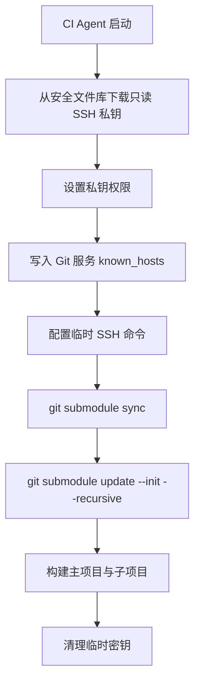

# 流水线拉取 Git 子模块

## 问题背景

主项目使用 Git Submodule 管理子项目。开发机可以凭借本地认证正常拉取，但 CI Agent 通常没有访问私有子仓库的身份，构建阶段会失败。

问题的关键不是 Submodule 命令本身，而是让流水线在有限时间和有限权限内获得子仓库读取权限。

## 核心方案

1. 为流水线创建专用的只读 SSH Key。
2. 将私钥保存到 CI 平台的安全文件或密钥存储中。
3. 在流水线运行时下载到 Agent 临时目录。
4. 设置严格文件权限。
5. 配置 `known_hosts`，校验 Git 服务器身份。
6. 执行 Submodule 初始化和递归更新。
7. 任务结束后清理临时密钥。



## Azure Pipelines 示例

安全文件由 `DownloadSecureFile` 下载。后续脚本只引用任务返回的临时路径，不在 YAML 中写入私钥内容。

```yaml
steps:
  - task: DownloadSecureFile@1
    name: submoduleKey
    inputs:
      secureFile: 'submodule-readonly-key'

  - script: |
      install -m 700 -d ~/.ssh
      install -m 600 "$(submoduleKey.secureFilePath)" ~/.ssh/id_ed25519
      ssh-keyscan -H git.example.com >> ~/.ssh/known_hosts

      export GIT_SSH_COMMAND="ssh -i ~/.ssh/id_ed25519 -o IdentitiesOnly=yes"
      git submodule sync --recursive
      git submodule update --init --recursive
    displayName: Checkout private submodules

  - script: rm -f ~/.ssh/id_ed25519
    condition: always()
    displayName: Remove temporary SSH key
```

示例域名和文件名均为占位值，实际值应由流水线变量或项目配置提供。

## 仓库配置

主项目通过 `.gitmodules` 声明子仓库。生产环境优先使用 SSH URL，以便使用专用部署密钥：

```ini
[submodule "shared-library"]
  path = libs/shared-library
  url = git@git.example.com:team/shared-library.git
```

如果开发者使用 HTTPS、流水线使用 SSH，可以在流水线中通过 URL 重写或更新 `.gitmodules`，但应避免同时维护多个不一致的来源地址。

## 安全原则

- 部署密钥只授予子仓库读取权限。
- 不复用个人开发者 SSH Key。
- 私钥只能存在于 CI 安全存储和 Agent 临时文件中。
- 不使用 `StrictHostKeyChecking=no` 绕过服务器身份校验。
- 流水线日志不得输出私钥内容、完整环境变量或认证命令。
- 清理步骤使用 `condition: always()`，确保构建失败时同样执行。
- 定期轮换密钥，并删除不再使用的公钥授权。

## 排障顺序

1. 检查 `.gitmodules` 中的路径和 URL。
2. 确认流水线签出的提交包含正确的 Submodule commit。
3. 确认专用公钥已添加到子仓库。
4. 在不输出密钥的前提下测试 SSH 握手。
5. 检查 `known_hosts` 是否包含正确服务端密钥。
6. 确认 `GIT_SSH_COMMAND` 对 Submodule 命令生效。
7. 若存在嵌套子模块，确认使用了 `--recursive`。

## 来源

- 飞书路径：`技术 / 后端 / 服务管理 / 服务部署 / pipline 子项目问题`
- 作者：罗浩远、许伟聪
- 最近修改：2025-06-17
