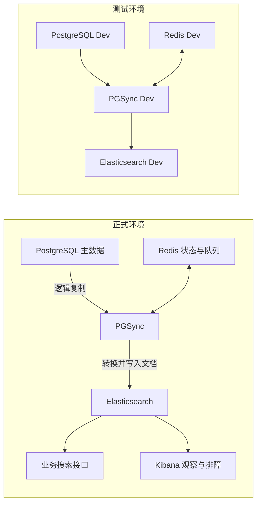
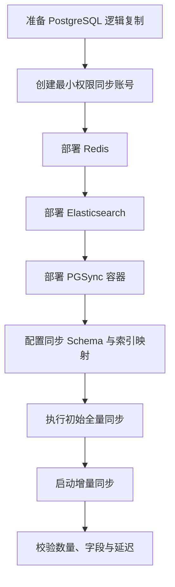
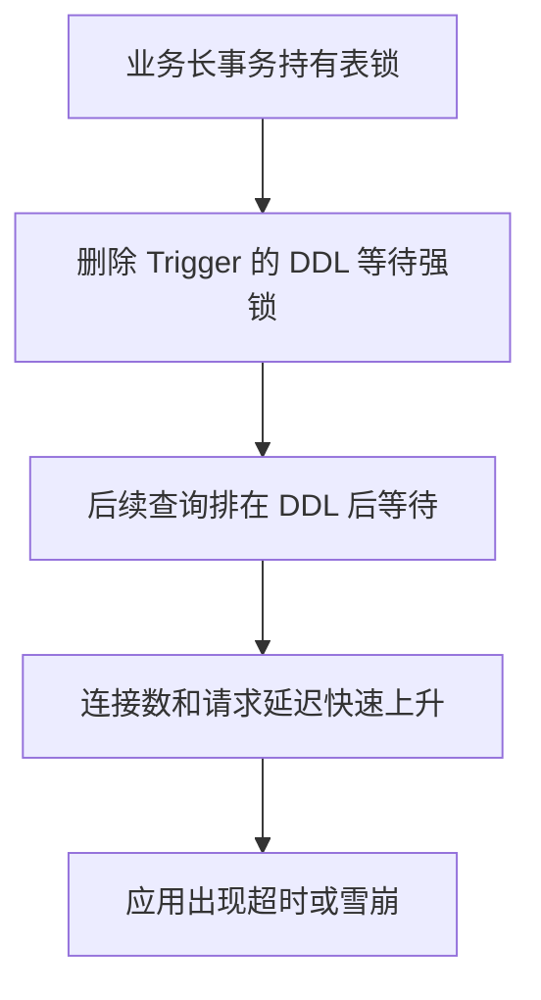

# PostgreSQL 到 Elasticsearch 的数据同步

## 背景与目标

业务数据以 PostgreSQL 为主存储，但复杂检索和全文搜索更适合由 Elasticsearch 承担。同步方案使用 PGSync 读取 PostgreSQL 的变更，并将适合查询的数据写入 Elasticsearch。

## 核心组件

| 组件 | 职责 |
| --- | --- |
| PostgreSQL | 保存业务事实数据，提供逻辑复制能力 |
| PGSync | 读取数据库变更、转换文档并同步到 Elasticsearch |
| Redis | 保存 PGSync 运行所需的队列或状态 |
| Elasticsearch | 提供搜索和聚合查询 |
| Kibana | 辅助查看索引和排查数据问题，非同步链路必需组件 |

## 整体架构

正式环境和测试环境应使用独立的服务、索引和配置，避免测试数据污染正式搜索结果。



## PostgreSQL 前置条件

PGSync 依赖 PostgreSQL 的逻辑复制能力，部署前需要：

1. 在数据库参数组中开启逻辑复制。
2. 按数据库平台要求重启或应用参数变更。
3. 创建专用同步账号。
4. 为账号授予复制以及读取所需表的权限。
5. 验证复制槽、触发器和同步状态。

## 部署方式

PGSync 应作为独立容器部署，不与应用服务或 Elasticsearch 进程混在同一容器。



## 安全设计

- 数据库密码、Redis 凭据和 Elasticsearch 认证信息只通过 Secret 或环境变量注入。
- 文档、代码仓库和容器镜像中不得出现真实密码。
- 同步账号只授予逻辑复制和必要表的读取权限，避免长期使用超级管理员权限。
- 正式环境和测试环境使用不同账号、密钥、索引和网络边界。
- 对复制槽积压、同步延迟和失败重试建立监控与告警。

## 运维风险

- 逻辑复制配置错误会导致 PGSync 无法获得增量变更。
- 长时间未消费的复制槽可能造成 PostgreSQL WAL 堆积。
- 修改或删除 PGSync 创建的触发器时可能产生锁表风险。
- Schema 或索引映射变更需要兼顾全量重建与增量同步的一致性。
- 应为同步服务设计幂等重试，避免重复事件造成脏数据。

## Trigger 锁表复盘

PGSync 的初始化、卸载或配置变更可能涉及 Trigger。对业务繁忙表执行 `DROP TRIGGER`、`ALTER TABLE` 等 DDL 时，需要获取较强的表锁；如果表上存在长事务，DDL 会等待锁，而排在它后面的普通查询也可能继续堆积，最终表现为整张表不可用。

### 典型故障链路



### 变更前

1. 确认 Trigger 的创建方、用途以及是否仍被 PGSync 使用。
2. 检查目标表是否存在长事务和活跃写入。
3. 在低峰期或维护窗口执行。
4. 设置较短的 `lock_timeout`，避免无限等待。
5. 准备中止 DDL 和恢复同步服务的回滚步骤。

```sql
BEGIN;
SET LOCAL lock_timeout = '3s';
-- 在确认对象名称后执行 DDL。
COMMIT;
```

锁未能及时获得时，应让操作失败并重新评估，而不是让 DDL 长时间卡在生产连接中。

### 故障处理中

1. 从 `pg_stat_activity` 和 `pg_locks` 查找等待中的 DDL。
2. 识别最早的阻塞事务以及它的业务来源。
3. 优先取消本次维护 DDL，快速解除后续请求排队。
4. 只有在确认业务影响后，才考虑终止真正的阻塞事务。
5. 观察连接池、数据库 CPU、锁等待和接口延迟是否恢复。

### 变更后

- 检查 PGSync 是否仍能消费增量事件。
- 检查复制槽和 WAL 积压。
- 对关键索引执行抽样数据一致性校验。
- 将 DDL 操作纳入可审查、可回滚的变更脚本。

> 本节根据原事故主题整理为通用处置准则；原子文档正文未能从飞书页面加载。

## 核心经验

数据库同步不是简单的数据搬运。可靠方案需要同时管理源库权限、变更捕获、转换规则、索引映射、环境隔离和可观测性。PostgreSQL 仍是事实来源，Elasticsearch 应被视为可重建的查询副本。

## 来源

- 飞书路径：`技术 / 后端 / 服务管理 / ElasticSearch / 整体同步方案`
- 补充材料：`技术 / 后端 / 服务管理 / ElasticSearch / 整体同步方案 / PGSync`
- 事故主题：`PGSync删除Trigger导致锁表问题`
- 作者：罗浩远
- 最近修改：2025-03-05
