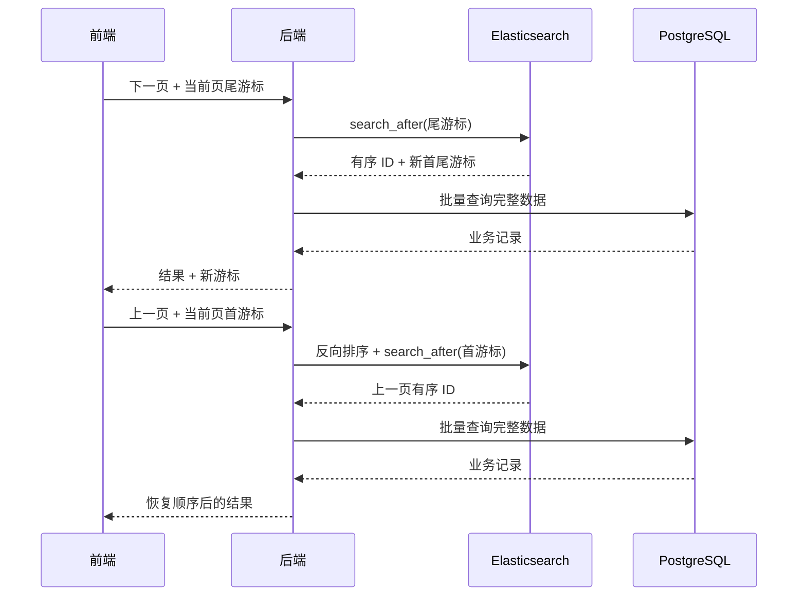

# Elasticsearch 查询与深分页

## 架构定位

Elasticsearch 负责搜索、过滤和排序，但 PostgreSQL 仍是完整业务数据的事实来源。

典型查询先从 Elasticsearch 获取有序 ID，再使用这些 ID 回表查询 PostgreSQL：


这种分工可以利用 Elasticsearch 的检索能力，同时避免把所有业务字段和一致性责任迁移到搜索引擎。

## 查询策略

### 文字查询

文字搜索由 Elasticsearch 完成匹配和排序，取得 ID 后到 PostgreSQL 查询完整记录。

### 时间排序

由 Elasticsearch 按时间字段排序并返回 ID。

查询非常靠后的尾页时，可以将排序方向反转，从数据末端开始查询，再将结果恢复为页面需要的顺序，减少遍历成本。

### 热度排序

需要根据候选数据规模决定查询引擎：

- 候选知识点较少时，使用 Elasticsearch 排序并回表。
- 候选范围很大或条件更适合关系查询时，直接使用 PostgreSQL。

这不是固定阈值规则。实际系统应通过压测确定分流条件，并持续观察两条路径的延迟。

### 综合排序

已有综合排序逻辑保持不变，避免为了统一技术栈而重写稳定的业务排序规则。

## 深分页问题

Elasticsearch 的 `from + size` 需要每个分片保留并排序目标页之前的所有结果。页码越深，CPU 和内存开销越高。

简单提高 `index.max_result_window` 只能扩大允许范围，不能消除深分页成本。调整前必须压测接近窗口上限时的响应时间和内存占用。

## 使用 search_after

深分页使用 `search_after`，把上一页最后一条记录的排序值作为下一次查询游标。

排序字段必须稳定且唯一。时间字段可能重复，因此需要增加 `_id` 或业务主键作为第二排序键。

```json
{
  "size": 100,
  "sort": [
    { "timestamp": "desc" },
    { "_id": "asc" }
  ],
  "search_after": [
    "2023-10-01T00:00:00",
    "abc123"
  ]
}
```

## 前后页交互

`search_after` 适合连续向前或向后浏览，不适合任意跳转到未知游标的页码。因此前端需要配合改变分页交互：

1. 达到深分页阈值后，不再提供任意页码跳转。
2. 页面只展示“上一页”和“下一页”。
3. 前端保存当前页首尾记录的完整排序值。
4. 请求下一页时，使用尾记录作为 `search_after`。
5. 请求上一页时，使用首记录并反转排序方向。
6. 后端查询后恢复前端期望的显示顺序。



## 关键设计判断

- 搜索引擎负责候选集和顺序，关系数据库负责完整数据和事实一致性。
- 深分页优先改变交互模式，而不是无限扩大结果窗口。
- `search_after` 的排序键必须稳定、可比较且能唯一定位记录。
- ES 回表后必须恢复 Elasticsearch 返回的 ID 顺序。
- 查询分流阈值应来自压测，而不是长期依赖未经验证的固定数字。

## 来源

- 飞书路径：`技术 / 后端 / 服务管理 / ElasticSearch / 查询方案`
- 作者：罗浩远
- 最近修改：2025-02-12
