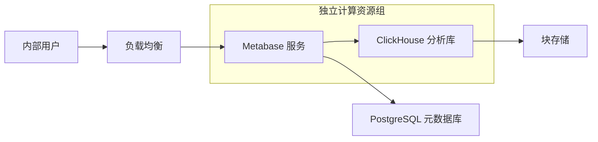
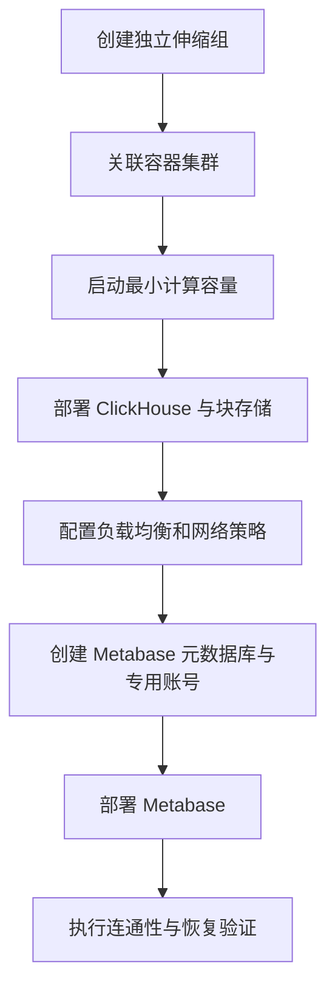

# Metabase 与 ClickHouse 部署

## 部署目标

为数据分析场景提供一套可独立扩缩容的查询与可视化服务：

- ClickHouse 负责分析数据的存储与查询。
- Metabase 负责数据探索、报表和仪表盘。
- PostgreSQL 只保存 Metabase 自身的元数据，不承担分析数据存储。

## 整体架构

计算资源与业务应用分组管理，可以单独设置容量、伸缩和故障边界。ClickHouse 是有状态组件，需要持久化块存储；Metabase 本身保持无状态，配置和用户信息写入外部 PostgreSQL。

## 部署顺序

1. 创建独立的自动伸缩组，初始容量设为零。
2. 创建容器集群，并将容量提供者映射到该伸缩组。
3. 将伸缩组调整到最小可运行容量，确认实例成功加入集群。
4. 部署 ClickHouse，挂载持久化块存储。
5. 通过支持 TCP 的负载均衡暴露所需服务，并仅向必要网络范围开放访问。
6. 部署 Metabase，将应用元数据连接到现有 PostgreSQL。
7. 完成健康检查、登录验证、查询验证和重启恢复测试。

## 元数据库设计

Metabase 需要专用数据库和专用登录账号。账号只授予连接目标数据库、创建和维护自身对象所需的权限，不应复用数据库管理员账号。

凭据通过 Secret 或受控环境变量注入，不写入代码、镜像、部署清单或运维文档。上线后还应验证：

- 专用账号能够连接目标数据库。
- Metabase 能完成初始化迁移并创建所需对象。
- 账号无法访问无关数据库和业务表。
- 容器重建后，用户、问题和仪表盘仍然存在。

## 关键取舍

### 为什么 ClickHouse 使用块存储

ClickHouse 的本地数据、合并过程和索引依赖稳定磁盘。将数据留在容器临时文件系统中，会在任务迁移或实例回收时造成数据丢失。块存储还需要配合快照、容量告警和恢复演练。

### 为什么 Metabase 不需要共享文件系统

Metabase 的持久状态保存在外部 PostgreSQL，应用容器可以按无状态服务运行。这样可以简化扩容和滚动升级，也避免多个副本依赖共享目录。

### 为什么使用独立计算资源组

分析查询可能产生突发 CPU、内存和磁盘负载。独立资源组能避免其挤占核心业务服务，也便于设置不同的实例规格、伸缩策略和维护窗口。

## 上线检查

- 计算实例能稳定加入集群，任务重启后能重新调度。
- ClickHouse 数据目录实际挂载到持久化存储。
- 负载均衡健康检查与服务协议匹配。
- 网络规则遵循最小开放原则，不直接暴露数据库。
- Metabase 元数据库已启用备份和恢复验证。
- ClickHouse 磁盘使用率、合并压力和查询延迟已纳入监控。
- 密钥轮换不会要求重新制作镜像。

## 故障经验

- 先创建集群映射、再增加伸缩组容量，能避免实例启动后未被集群接管。
- 有状态服务部署完成不等于数据安全，必须验证任务迁移和实例回收后的恢复能力。
- 网络连通问题应按安全组、负载均衡监听、目标健康检查和容器监听地址逐层排查。
- 元数据库权限过少会导致初始化迁移失败，权限过大则扩大泄露后的影响面，应以实际建表和迁移需求为边界。

## 来源

- 飞书路径：`技术 / 后端 / 服务管理 / Metabase / 部署`
- 作者：罗浩远
- 最近修改：2025-08-29
- 基础使用教程未单独迁移
