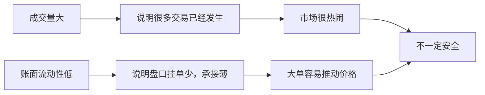
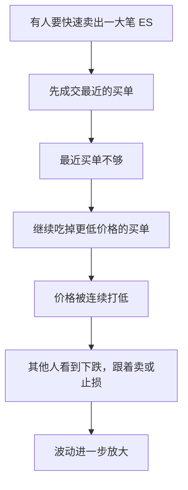
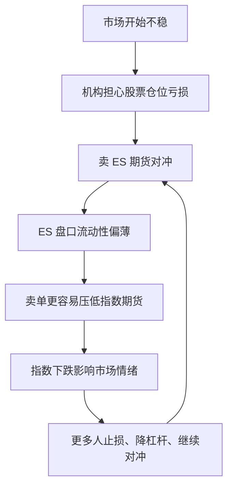
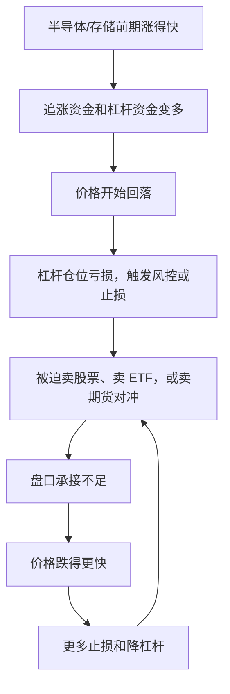

# 为什么成交量放大但账面流动性下降，会让市场波动变大？

来源问题：[2026-07-03 Rhino 美股盘后复盘](/trading/experts/rhino-finance/market-reviews/2026-07-03)里提到：6 月美国股市成交量很大，但标普 500 E-mini 期货账面流动性下降，所以如果市场反向，可能出现更大的波动和下跌。

这句话刚看会很绕，因为它把“成交量”“盘口流动性”“期货对冲”“杠杆踩踏”几个概念放在了一起。先用小白版讲清楚。


## 先记住一句话

成交量大，不等于市场好承接。

成交量是“今天已经成交了多少”；账面流动性是“此刻盘口上有多少人愿意接你的单”。

一个市场可以非常热闹，成交量很大，但每个价格上愿意接单的人很少。这样一来，大买单会把价格很快推上去，大卖单也会把价格很快砸下去。



## 用一个排队买水果的例子理解

假设苹果现在 10 元一斤。

如果摊位上每个价格都有很多苹果：

| 价格 | 愿意卖出的苹果 |
| --- | --- |
| 10.0 元 | 1000 斤 |
| 10.1 元 | 1000 斤 |
| 10.2 元 | 1000 斤 |

你买 500 斤，只会在 10.0 元成交，价格不怎么动。

但如果摊位很薄：

| 价格 | 愿意卖出的苹果 |
| --- | --- |
| 10.0 元 | 50 斤 |
| 10.1 元 | 60 斤 |
| 10.2 元 | 70 斤 |

你还是想买 500 斤，就必须一路把 10.0、10.1、10.2 后面的货都吃掉，价格会被你“扫上去”。

股票和期货也是类似。盘口薄的时候，大单不是在一个价格成交完，而是一路扫掉很多价格。

## Rhino 那组数据到底在说什么

文字稿里记录了两组数：

| 数据 | Rhino 提到的数字 | 小白解释 |
| --- | --- | --- |
| ES 期货账面流动性 | 从 1200 万美元降到 800 万美元，环比下降 33% | 盘口上愿意接单的“垫子”变薄了 |
| 美国股市日均成交量 | 6 月日均 233 亿股，6 月 18 日 330 亿股，6 月 26 日 320 亿股 | 市场交易很活跃，很多人在买卖 |

这两个数放在一起，意思是：

```text
想交易的人更多了，但盘口能承接大单的垫子反而变薄了。
```

所以风险不是“没人交易”，而是“大家都在交易，但一旦方向一致，盘口接不住”。

## 公式怎么理解

### 1. ES 期货一手是多少钱

ES 是标普 500 E-mini 期货。它的合约乘数是 50 美元。

```text
1 手 ES 的名义价值 = ES 点位 x 50 美元
```

如果 ES 在 6000 点附近：

```text
1 手 ES = 6000 x 50 = 300,000 美元
```

也就是说，买卖 1 手 ES，大约相当于控制 30 万美元的标普 500 敞口。

### 2. 账面流动性怎么粗略算

假设盘口上有这些挂单：

| 方向 | 价格 | 手数 |
| --- | --- | --- |
| 买单 | 5999.75 | 10 手 |
| 买单 | 5999.50 | 8 手 |
| 卖单 | 6000.25 | 9 手 |
| 卖单 | 6000.50 | 7 手 |

粗略算法就是把这些挂单换成美元：

```text
盘口名义金额 ≈ Σ(价格 x 手数 x 50)
```

如果只统计最优一档，就是只看最靠近当前价格的买一和卖一。如果统计前 5 档，就是把前 5 档买单和卖单都加起来。不同机构的图表口径可能不一样，所以一定要看注释。

### 3. 1200 万降到 800 万，为什么是下降 33%

```text
下降比例 = (800 万 - 1200 万) / 1200 万
        = -400 万 / 1200 万
        = -33.3%
```

小白理解：原来盘口垫子有 1200 万美元，现在只有 800 万美元，少了三分之一。

## 为什么盘口薄会让波动变大

关键是“大单会吃掉很多档价格”。



如果盘口很厚，大单卖出时有很多买盘接住，价格可能只跌一点。

如果盘口很薄，同样一笔卖单就可能打穿好几个价位。你看到的盘面就是突然一根长阴线、快速跳水、日内波动很大。

所以 Rhino 的逻辑是有道理的：成交量大说明市场忙，但真正决定“会不会被大单砸穿”的，是盘口深度。

## Rhino 说的“对冲”可以怎么理解？

这里最容易糊涂。对冲不是预测市场一定跌，而是机构在保护自己。

举个简单例子：

一个基金手里持有很多科技股、半导体股。它担心短期大盘下跌，但又不想马上把股票全卖掉。它可以卖出 ES 期货来对冲。


这件事本身是正常的。

问题在于：如果很多机构同时想对冲，就会出现很多 ES 卖单。平时盘口厚，市场能接住；但盘口薄的时候，这些对冲卖单本身就可能把价格压下去。



这就是 Rhino 担心的点：对冲本来是防守动作，但当大家都在同一时间防守，而且盘口又薄，防守动作本身可能变成下跌推力。

## 它和半导体、杠杆 ETF 有什么关系

Rhino 那期同时提到半导体、存储、高杠杆、ETF 敞口。可以这样理解：

如果某个板块前期涨得很猛，里面可能有很多追涨资金、杠杆资金、期权仓位、ETF 仓位。上涨时大家都舒服；一旦下跌，就容易触发连锁反应。



这就是“踩踏”。

它不一定发生，但如果发生，往往不是慢慢跌，而是突然加速。Rhino 所以说要等确认，不急着追 ISRG、NFLX 这种当天大涨的票，因为在流动性不稳时，个股上涨可能只是资金暂时找地方躲，不一定代表全市场风险消失。

## Rhino 这个判断有没有道理？

我觉得有道理，但要加边界。

有道理的地方：

- 成交量大不代表承接好，这个判断正确。
- ES 是美股最重要的指数对冲工具之一，机构用它对冲股票组合很常见。
- 盘口流动性下降时，大单的价格冲击会变大。
- 如果高杠杆仓位集中在热门板块，反向波动可能触发止损、对冲和被动卖出。

需要注意的地方：

- 800 万/1200 万这个“账面流动性”数字，要看数据商具体口径，是一档、五档，还是某个价格范围内的深度。
- ES 流动性变差，不等于市场一定大跌；它只是说明一旦有大单冲击，波动更容易被放大。
- 成交量用的是全市场股票成交股数，流动性用的是 ES 期货盘口美元金额，两者不是同单位，不能直接相除。
- 对冲卖单只是可能的压力来源之一，还要看期权做市商、ETF 再平衡、基金赎回、宏观消息等因素。

所以更准确的结论是：

```text
Rhino 不是在说“因为流动性下降，所以一定暴跌”。
他是在说“现在盘口承接变薄，如果市场反向，卖单、对冲和杠杆止损可能更容易把波动放大”。
```

## 以后看到类似说法怎么判断

可以问四个问题：

1. 他说的流动性，是盘口深度、成交量，还是融资流动性？
2. 盘口深度统计的是一档、五档，还是某个价格范围？
3. 成交量是股数、金额，还是期货合约数？
4. 他是在说“风险变大”，还是在说“市场一定下跌”？

只要能分清第 4 点，就不会把风险提示误解成确定性预测。

## 参考来源

- [2026-07-03 Rhino 视频文字稿](/trading/experts/rhino-finance/transcripts/2026-07-03)：本问题中的 1200 万、800 万、233 亿股、330 亿股、320 亿股来自这里的整理记录。
- [CME E-mini S&P 500 Futures](https://www.cmegroup.com/markets/equities/sp/e-mini-sandp500.html)：用于确认 ES 是 CME 标普 500 E-mini 期货产品，以及其合约背景。
- [CME: Reassessing Liquidity: Beyond Order Book Depth](https://www.cmegroup.com/articles/2025/reassessing-liquidity-beyond-order-book-depth.html)：用于理解订单簿深度只是流动性的一个维度，价格冲击等指标也需要一起看。
- [Cboe U.S. Equities Market Volume Summary](https://www.cboe.com/us/equities/market_share/)：用于追踪美国股票市场范围成交量和名义成交金额。
- [SEC/CFTC: Preliminary Findings Regarding the Market Events of May 6, 2010](https://www.sec.gov/sec-cftc-prelimreport.pdf)：用于理解 E-mini S&P 500 中订单簿失衡、价差扩大和快速价格冲击如何在极端行情中放大波动。

仅供学习，不构成投资建议。
