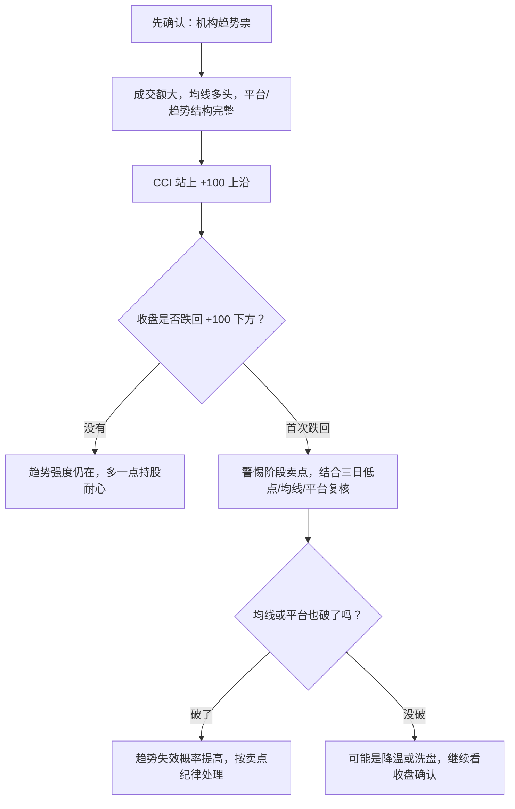

# CCI 指标到底在看什么？为什么能辅助趋势持有？

来源问题：[比巴卜作手游资交易系统第 16 课](/trading/experts/bibabu-zuoshou/member-topics/hot-money-system/16-institutional-trend-three-day-profit)里提到，机构趋势票可以用 CCI 辅助判断趋势是否还在上沿上方：如果 CCI 站上上沿后没有收盘跌回上沿下方，就多一点耐心；第一次收盘跌回上沿下方，要警惕阶段卖点。

这句话的重点不是“看到 CCI 就买卖”，而是：在已经满足机构趋势票前提时，CCI 可以帮我们判断价格偏离均值的强弱状态有没有明显降温。


## 先记住一句话

CCI 看的不是价格贵不贵，而是价格离自己的平均状态有多远。

它像一个“偏离度温度计”：

| CCI 区域 | 小白理解 | 交易含义 |
| --- | --- | --- |
| 高于 +100 | 价格明显强于近期平均状态 | 趋势可能进入强势段，但不等于可以无脑追 |
| -100 到 +100 | 偏离不极端 | 震荡、整理、趋势中继都可能出现 |
| 低于 -100 | 价格明显弱于近期平均状态 | 可能超跌，也可能是弱势延续 |
| 回到 0 附近 | 回到近期平均附近 | 方向感降低，需要重新看结构 |

所以 CCI 不是方向盘，更像仪表盘。方向盘仍然是趋势结构、均线、平台、成交额、题材逻辑和卖点纪律。

## 公式怎么理解

CCI 的完整公式看起来有点绕：

```text
CCI = (TP - MA) / (0.015 x MD)
```

其中：

```text
TP = (最高价 + 最低价 + 收盘价) / 3
MA = TP 的 N 日移动平均
MD = TP 相对 MA 的平均偏差
```

翻译成人话：

1. 先用最高价、最低价、收盘价算一个“典型价格”。
2. 再看这个典型价格和过去 N 日平均水平差多少。
3. 最后用平均偏差把这个差距标准化，得到一个可以比较的数。


这里的 `0.015` 是一个缩放系数，目的是让大部分普通波动落在 `-100` 到 `+100` 附近。不同周期、不同股票、不同软件参数会影响数值，所以不要把 `+100`、`-100` 当成绝对真理，它们更像观察线。

## 为什么 CCI 高于 +100 不一定是“卖”

很多指标教程会说：

```text
CCI > +100：超买
CCI < -100：超卖
```

这句话容易让人误会。因为“超买”在震荡市里可能代表短线过热，但在强趋势里，也可能代表主升正在展开。

举个简单例子：

| 市场状态 | CCI 高于 +100 的含义 | 更合理的处理 |
| --- | --- | --- |
| 震荡箱体 | 可能接近箱体上沿，容易回落 | 看压力位和放量滞涨 |
| 趋势主升 | 强势偏离正在维持 | 看是否收盘跌回 +100 下方 |
| 高位加速末端 | 可能进入情绪亢奋 | 结合长上影、放量阴线、均线破位 |
| 弱反弹 | 可能只是修复到均值上方 | 看能否带量突破平台 |

同一个 CCI 数值，放在不同结构里，意义完全不同。

这也是第 16 课的关键：比巴卜讲的是机构趋势票的持有辅助，不是把 CCI 当成所有股票的买卖按钮。

## 第 16 课里的使用语境

第 16 课先给了前提，再讲 CCI。

前提大致是：

1. 股票是机构趋势票，不是连板情绪小票。
2. 有大成交，说明资金容量够。
3. 属于机构方向，逻辑和资金风格能解释趋势。
4. 均线多头排列，价格结构没有坏。
5. 买点最好来自低吸、回踩或平台，而不是盲目追高。

在这些条件成立后，CCI 才进入辅助位置。


可以把它理解成一个持有过滤器：



这套逻辑最有价值的地方，是帮人对抗趋势票里的盘中震荡。趋势股经常会有水下震荡、冲高回落、日内下杀，如果只看分时，很容易把正常波动当成见顶。CCI 加上收盘确认，可以减少被盘中情绪带走。

## 和三日持股法怎么配合

第 16 课里，CCI 不是单独使用，而是和三日持股法、平台底部、均线结构一起用。

可以这样分工：

| 工具 | 解决的问题 | 更像什么 |
| --- | --- | --- |
| 三日持股法 | 趋势票有没有跌破短期持有纪律 | 止盈纪律 |
| 平台底部 | 箱体洗盘有没有真正破位 | 结构边界 |
| 均线多头 | 中短期趋势有没有走坏 | 趋势骨架 |
| CCI | 强势偏离有没有明显降温 | 强弱温度计 |
| 逻辑利空 | 持股基础是否直接被破坏 | 一票否决 |

一个更稳的判断顺序是：

```text
先问是不是趋势票
再问结构有没有破
再问 CCI 有没有收盘跌回上沿下方
最后问是否触发自己的卖点纪律
```

不要反过来：

```text
CCI 还在 +100 上方，所以所有问题都不用管
```

这就把辅助工具用成了信仰。

## 四种常见误用


### 1. 只看 CCI，不看趋势结构

如果股票本身没有均线多头、没有平台支撑、没有成交额和机构方向，只因为 CCI 上穿 +100 就追，本质是在用一个指标替代交易系统。

正确做法是：CCI 只能回答“偏离强不强”，不能回答“这只票值不值得做”。

### 2. 把盘中跌破当成收盘破位

第 16 课强调止盈止损尽量看收盘价，除非盘中出现很明显的出货盘口。

原因很简单：趋势票盘中经常会下杀洗盘，盘中跌破 +100 后收盘又收回去，和收盘确认跌回 +100 下方，意义不同。

### 3. 把 CCI 硬套到连板情绪小票

连板情绪小票主要看情绪周期、空间压制、板块地位、盘口强弱和晋级失败风险。它的波动速度太快，CCI 这种偏离度指标容易滞后。

第 16 课的语境是机构趋势票，不是所有短线票。

### 4. 看到高位钝化就盲目追

CCI 长时间在 +100 上方，说明强势，也说明偏离已经很大。趋势股可以强者恒强，但越到后面越要看卖点，而不是越涨越兴奋。

更好的问法是：

```text
我现在是在低吸趋势，还是在追高接力？
如果明天跌破三日低点、平台底部或 +100 上沿，我怎么处理？
```

## 一张表区分 CCI、RSI、MACD

| 指标 | 主要看什么 | 更适合辅助什么 | 容易误解 |
| --- | --- | --- | --- |
| CCI | 价格相对均值的偏离程度 | 趋势强弱、偏离过热、趋势降温 | 以为 +100 必卖、-100 必买 |
| RSI | 涨跌速度和强弱 | 短期强弱、背离、超买超卖 | 以为超买后一定马上跌 |
| MACD | 均线差和趋势动能 | 趋势方向、动能变化 | 金叉死叉滞后，震荡市反复打脸 |

如果要用在比巴卜第 16 课这套机构趋势语境里，CCI 的优势是：它能比较直观地告诉你，价格是否仍然保持在强势偏离区。它的缺点也很明显：它只看价格统计特征，不知道题材逻辑有没有变、资金有没有撤、公司有没有利空。

## 实战检查清单

看 CCI 前，先问：

- 这是不是机构趋势票，而不是情绪连板票？
- 成交额是否足够大，能容纳机构资金？
- 均线是否仍然多头排列？
- 平台底部、三日低点、关键均线有没有破？
- 这次 CCI 跌回上沿下方，是盘中刺破，还是收盘确认？
- 有没有逻辑利空、放量长上影、阴包阳、趋势线破位等共振卖点？

如果答案都偏正面，CCI 可以帮助你“多一点耐心”。

如果结构已经坏了，CCI 就不该成为继续幻想的理由。

## 以后看到 CCI 信号怎么读

可以按三层读法：

1. **指标层**：CCI 在 +100 上方、-100 下方，还是中间区域？
2. **结构层**：价格是在趋势主升、箱体震荡、破位下跌，还是超跌反弹？
3. **系统层**：这个信号和你的买点、卖点、仓位、失效条件是否一致？

最重要的是第三层。指标只提供信息，交易系统才决定动作。

## 参考来源

- [比巴卜作手游资交易系统第 16 课学习笔记](/trading/experts/bibabu-zuoshou/member-topics/hot-money-system/16-institutional-trend-three-day-profit)：本文关于“机构趋势票、三日持股法、CCI 上沿辅助持有”的课程语境来自这里。
- [第 16 课文字稿](/trading/experts/bibabu-zuoshou/member-topics/hot-money-system-transcripts/16-institutional-trend-three-day-profit)：用于确认作者对 CCI 的表述是趋势持有辅助，而非单独买卖指标。
- [Investopedia: Commodity Channel Index](https://www.investopedia.com/terms/c/commoditychannelindex.asp)：用于核对 CCI 的通用定义、公式和典型解释。
- [Investopedia: Timing Trades With the Commodity Channel Index](https://www.investopedia.com/investing/timing-trades-with-commodity-channel-index/)：用于核对 CCI 常见参数、+100/-100 区间和需要结合其他工具使用的边界。

仅供学习，不构成投资建议。
