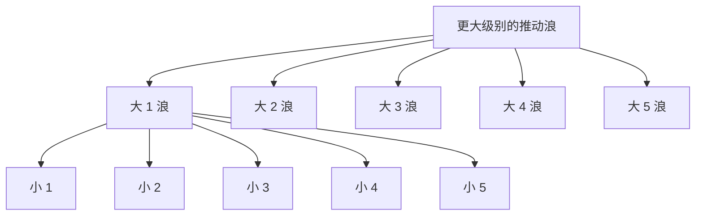
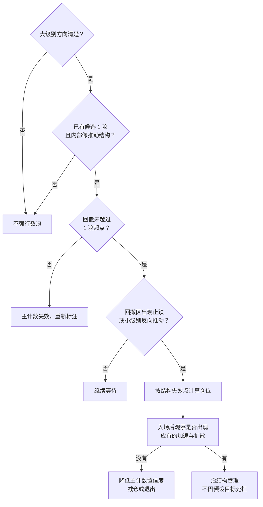

# 为什么市场总像在“前进五步、回望三步”？波浪理论从来源、逻辑到实战


*图：AI 生成的主题插画。大潮中包含小潮，暗示不同周期的走势可能呈现相似结构；它是概念隐喻，不是可用于数浪的标准图。*

> [!NOTE]
> 这是一篇“基础到实战篇”。目标不是把所有复杂浪型一次讲完，而是建立一套能排除错误、能写出备选路径、能管理风险的入门框架。复杂调整浪、倾斜三角形、浪级记号和量化检验将在后续篇章继续完善。

## 先讲一个故事：没有统一钟表的群岛

很久以前，一片群岛没有统一的钟表。岛民只根据码头上的人群决定何时出海。

起初，只有少数水手发现远方可能有新航路。他们悄悄买船，船价从沉寂中抬头。多数人仍不相信，因为旧航路刚刚让大家亏过钱。

随后，一场风暴传闻传来，刚买船的人纷纷后悔，船价几乎退回原处，却没有跌破最早那批水手的底线。传闻过去后，越来越多人看见新航路确实存在，商人、船厂和搬运工一起涌入。船价上涨得最快，码头上人人都在谈论出海。

船越来越贵，一部分人停下来清点货物。价格有所回落，但大多数人已接受新航路的存在，没有人愿意按最初的低价卖船。最后，最迟到的人被繁荣故事吸引，纷纷借钱买船。船价又创了新高，码头却没有上一轮那么忙碌。

这时，第一批水手开始返航卖船。其他人说这只是短暂降价；船价跌了一段后，也确实反弹了。可反弹没能恢复从前的热闹。等到越来越多人发现利润不及传闻，船价再次下跌，退回到更能被真实需求支撑的位置。

一名学徒把整个过程画成“上、下、上、下、上；再下、上、下”。他以为找到了永远准确的时钟。老船长却擦掉了图上的最后一个点：

> 你画出的不是时间表，而是人群从怀疑到相信、从相信到拥挤，再从否认到接受的秩序。秩序可以相似，长度从不保证相同。更麻烦的是，每一段大航程里，还有无数次更小的犹豫与追逐。

这个故事揭示的概念，就是 **艾略特波浪理论（Elliott Wave Principle）**。

## 寓言与理论的对应关系

| 故事阶段 | 常见浪位 | 群体心理的典型变化 | 价格结构 |
| --- | --- | --- | --- |
| 少数水手先行动 | 1 浪 | 怀疑中出现先行者 | 原趋势之后的第一次推动 |
| 风暴传闻、几乎退回 | 2 浪 | 旧记忆仍强，市场质疑新趋势 | 深回撤，但正常脉冲浪中不应越过 1 浪起点 |
| 新航路得到承认 | 3 浪 | 共识扩散，参与面扩大 | 通常强而广，且不能是 1、3、5 中最短的一浪 |
| 停下来清点货物 | 4 浪 | 获利了结，但主趋势共识尚在 | 调整；正常脉冲浪中不与 1 浪价格区间重叠 |
| 迟到者借钱进场 | 5 浪 | 乐观趋于拥挤，可能出现动能背离 | 最后一段顺势推动，不一定是最长 |
| 先行者返航 | A 浪 | 多数人仍当作普通回调 | 第一段反向运动 |
| “只是短暂降价” | B 浪 | 否认与希望回归 | 对 A 浪的反弹 |
| 现实重新定价 | C 浪 | 原趋势叙事被广泛修正 | 第二段反向运动，完成或推进调整 |

类比的边界也要说清：真实市场不是整齐排队的人群，同一张图可以存在多个合理浪级和备选数法；新闻、估值、流动性与制度会影响走势，而波浪标签只是对价格结构的解释，不是独立的因果证明。

## 它从哪里来？

拉尔夫·纳尔逊·艾略特（Ralph Nelson Elliott，1871—1948）原本从事会计和企业管理工作。他在 1930 年代研究股票指数历史数据，提出市场走势会以可识别的形态反复展开。1938 年，他与 Charles J. Collins 合作出版 *The Wave Principle*；1946 年又在 *Nature's Law* 中扩展其思想，并把斐波那契关系放进整体框架。

这套理论后来一度只在小范围内流传。1978 年，A. J. Frost 与 Robert Prechter 出版 *Elliott Wave Principle: Key to Market Behavior*，使其重新进入更广泛的技术分析视野。

需要区分历史事实与后来的解释：

- 艾略特的核心工作，是分类价格形态、浪级与相互关系。
- “社会情绪推动社会事件”的 socionomics，是 Prechter 后来进一步发展的理论，不宜全部倒推成艾略特当年的原始结论。
- “分形”一词后来才普及。说艾略特发现了类似分形的自相似市场结构，比说他使用了现代分形数学更准确。

## 核心逻辑：它研究的不是海浪，而是结构、层级与预期

波浪理论可以压缩成三个命题。

### 1. 趋势与逆趋势的结构不同

在最基础的理想模型中，顺着更大一级趋势的推动阶段由 5 个子浪组成，逆着更大一级趋势的调整阶段由 3 个子浪或“三浪结构的组合”组成。


这里的“5 上、3 下”只是在上涨趋势中的画法。下降趋势完全可以镜像为“5 下、3 上”。

更重要的是，**五浪不是五根 K 线，三浪也不是三根 K 线**。一个浪可以持续几分钟，也可以持续数年；标签描述的是结构层级，不是固定时间。

### 2. 大结构由小结构组成

一个大级别的 1 浪，内部可以再拆成小级别的 1、2、3、4、5；整个大级别的 1—5，又可能只是更高一级的一个 1 浪。



所以“日线在下跌”和“小时线在上涨”并不冲突：小时上涨可能只是日线调整中的 B 浪。应用时必须先声明观察周期和浪级，否则所有数浪都可以被事后改写。

### 3. 理论提供的是受约束的情景，不是唯一剧本

专业数浪的价值，不是给每个拐点贴上唯一标签，而是：

1. 找出当前仍符合规则的主计数；
2. 保留至少一个合理备选计数；
3. 为每个计数写出确认条件和失效点；
4. 当价格否定主计数时，切换情景，而不是移动规则。

这使波浪理论更接近一棵“可证伪的路径树”，而不是一条神秘预测线。

## 先背三条硬规则，再谈所有经验

以下三条针对标准 **脉冲浪（impulse）**：

| 硬规则 | 人话 | 违反后怎么办 |
| --- | --- | --- |
| 2 浪不能回撤超过 1 浪的起点 | 新趋势如果把第一段完整吞没，这组 1—2 标注失效 | 重数，不能说“特殊情况” |
| 3 浪不能是 1、3、5 中最短的一浪 | 3 浪不一定最长，但不能最短 | 检查浪级、端点或整个计数 |
| 4 浪不能进入 1 浪价格区域 | 标准脉冲中，两个调整不能重叠到这种程度 | 重数；但倾斜三角形是另一个合法结构，规则不同 |

> [!WARNING]
> “3 浪必须最长”是常见误记。正确说法是“3 浪不能最短”。如果 1 浪长 10、3 浪长 12、5 浪长 20，完全没有违反这条规则。

### 规则和指引不是一回事

规则一旦违反，计数失效；指引只描述“经常如此”，可以不发生。

常见指引包括：

- **交替：** 如果 2 浪又深又急，4 浪往往更横向、更复杂，反之亦然。
- **延长：** 1、3、5 中常有一浪明显延长，3 浪最常见，但不是保证。
- **通道：** 连接 1、3 浪端点并过 2 浪作平行线，可辅助观察 4 浪或 5 浪可能的运行边界；它是工具，不是硬规则。
- **波浪个性：** 1 浪常伴随怀疑，3 浪常伴随广泛确认，5 浪常伴随情绪拥挤或动能不再同步。

把指引写成“必须”，会制造虚假的确定性；把规则说成“偶尔例外”，则会让理论失去可证伪性。

## 调整浪为什么比推动浪更难？

“调整就是 A-B-C”只是入门地图，不是全部地形。推动浪顺着更大趋势展开，形态相对清晰；调整浪同时受到更大趋势与短期反向力量拉扯，可能横向延长、组合或在尚未完成时看似已经结束。

基础阶段先认识三类：

| 类型 | 常见内部结构 | 外观与语境 | 入门时如何处理 |
| --- | --- | --- | --- |
| 锯齿形 Zigzag | 5-3-5 | 反向明显、较陡 | A、C 都较有推动感，C 常与 A 比较长度 |
| 平台形 Flat | 3-3-5 | 横向整理，B 可能接近或越过起点 | 不要因 B 浪创新高就断言调整结束 |
| 三角形 Triangle | 3-3-3-3-3 | 波幅收敛或扩张，常见于 4 浪或 B 浪 | 等形态完成与突破，不在内部来回追 |

此外还有双重三浪、三重三浪等组合。一个非常实用的原则是：**调整没走完时最容易被误判，越复杂越要降低预测精度、缩小仓位或等待结构突破。**

## 斐波那契在波浪理论里是什么角色？

波浪理论经常用斐波那契比例估算回撤和延伸，例如：

- 2 浪常观察 1 浪的 50%、61.8% 或 78.6% 回撤区；
- 3 浪常观察 1 浪长度的 1.618 倍附近；
- 4 浪常比 2 浪浅，可能观察 3 浪的 23.6% 或 38.2%；
- 当 3 浪延长时，5 浪可能与 1 浪接近等长。

这些都是经验关系，不是硬规则。正确顺序应是：

```text
先识别价格结构
  → 再用硬规则排除错误计数
  → 再用比例估算候选区域
  → 最后等价格行为确认
```

若先决定“这里必须是 61.8%”，再为了配合比例强行数浪，就把测量工具变成了确认偏误。关于比例本身，可继续阅读[斐波那契回撤与扩展教程](/trading/questions/2026-07-21-fibonacci-trading)。

## 实际应用：不要预测“下一点”，要管理“下一段”

### 第一步：从高周期确定上下文

先在周线或日线回答：

- 高点和低点总体抬高，还是降低？
- 当前走势更像顺大趋势推动，还是逆大趋势调整？
- 哪个起点被突破后，会直接否定当前判断？

不要一上来就在 5 分钟图数几十个小浪。没有大级别上下文，小级别标签只会随噪声变化。

### 第二步：先找“完成的结构”，再标正在走的浪

已经完成的五浪或三浪，比尚未完成的末端更容易识别。可以从一个明显高低点向右观察：

1. 是否出现方向清楚的五段推动？
2. 其中 2、4 浪是否有调整特征？
3. 三条硬规则是否全部满足？
4. 成交量、动能和市场广度是否与所标浪位大致协调？

指标只能辅助。例如，3 浪通常动能较强，5 浪有时出现价格新高而 MACD 不创新高；但没有背离也可以是 5 浪，有背离也不等于趋势立即反转。

### 第三步：同时写主计数与备选计数

假设一只股票从 100 上涨到 110，回撤到 104，再上涨到 126。你可以提出：

- **主计数：** 100→110 是 1 浪，110→104 是 2 浪，104→126 正处于或完成 3 浪。
- **备选计数：** 整段上涨只是更大级别下跌中的 A-B-C 反弹，126 附近可能接近 C 浪末端。

两种解释都可能暂时成立，因此需要用条件区分：

| 情景 | 支持证据 | 失效或明显转弱 |
| --- | --- | --- |
| 主计数：新上升脉冲 | 回调守住 100；后续 4 浪不进入 1 浪区域；整理后再创新高 | 跌破 100，或标准脉冲规则被破坏 |
| 备选：下跌中的反弹 | 大级别仍是更低高点；126 附近出现衰竭并跌破反弹结构 | 强势突破大级别关键高点，并形成新的推动结构 |

这一步的价值，是阻止你把“我看涨”伪装成“理论已经证明上涨”。

### 第四步：把失效点变成仓位约束

如果候选入场价为 118，结构失效点为 113，单股风险为 5。账户 100,000，计划单笔最多亏损 0.5%，风险预算是 500：

```text
候选仓位 = 500 ÷ (118 − 113) = 100 股
```

若隔夜跳空、滑点或流动性风险较高，还要进一步打折。止损应放在“计数或交易逻辑被否定的位置”，而不是为了买更多仓位，随意把止损挪近。

### 第五步：只在价格提供确认时行动

一个较完整的“疑似 2 浪结束、尝试参与 3 浪”模板是：



关键不是抓到最低点，而是：一旦它真是 3 浪，价格应该逐步表现出趋势该有的力量；如果迟迟没有，就要承认信息与预期不匹配。

## 一个简化案例：从“看图说话”变成事前计划

假设某指数出现以下摆动：

```text
P0 = 1,000
P1 = 1,080
P2 = 1,035
P3 = 1,210
P4 = 1,155
当前 = 1,190
```

先做规则检查：

1. `P2 > P0`，候选 2 浪没有跌破 1 浪起点；
2. 1 浪长度为 80，3 浪长度为 175，3 浪目前不是最短；
3. 1 浪价格区域最高到 1,080，P4 为 1,155，候选 4 浪没有进入 1 浪区域。

因此“当前可能处于 5 浪”是一个合法候选，但不是事实。接下来写计划：

- 若突破 1,210 且小级别呈推动结构，5 浪延续的概率增加；
- 若上涨创新高但动能和广度走弱，只把它当作风险提示，不直接猜顶；
- 若跌破 1,155，先检查 4 浪是否仍在延长；
- 若进一步进入 1,080 以下，标准脉冲计数被破坏，必须重新评估整个结构；
- 盈亏比不足时，即使数浪“看起来正确”也不交易。

同一组数据还可能是更高级别调整中的 C 浪上行。因此图上应该保留备选标签，并观察更大级别关键高点是否被真正突破。

## 波浪理论最常见的七个误区

### 1. 每次都能数出唯一答案

真实分析经常存在两个甚至更多合法计数。好的分析不是消灭不确定性，而是把不确定性组织成少量可验证情景。

### 2. 看到三段就是调整，看到五段就是趋势

必须先定义浪级。一段大级别 A 浪内部也可以由五个小浪组成；脱离层级谈“五浪必涨”会自相矛盾。

### 3. 为了保住观点不断改标签

价格一旦违反硬规则，就应承认原计数失效。若每次都扩大浪级、移动端点或发明“延长浪”，任何走势都能被事后解释。

### 4. 用斐波那契精确点位代替确认

1.618 是候选关系，不是市场订单。价格可以提前转向、穿越后再回，也可以完全不尊重它。

### 5. 把指引当规则

5 浪没有背离、2 浪没有回撤到 61.8%、4 浪没有横盘，都不自动使计数失效。

### 6. 只谈目标，不谈失效

没有失效点的“浪 3 目标 1.618”不是交易计划，只是方向观点。

### 7. 在低流动性个股上过度精细数浪

自由交易、参与者广泛的市场更接近群体行为假设。单一事件、控盘、涨跌停、长时间停牌或极低流动性，都会让标准形态的解释力下降。

## 它有哪些真正的优点？

- **强迫你思考层级：** 区分大趋势与小回撤。
- **提供失效条件：** 三条硬规则能排除部分错误解释。
- **把方向、阶段和目标放进同一框架：** 不只说涨跌，还讨论趋势是否成熟。
- **适合情景规划：** 主计数与备选计数可以对应不同交易动作。
- **能与结构交易结合：** 前高前低、通道、成交量、动能和斐波那契都能成为辅助证据。

## 它的局限也必须正面承认

1983 年发表于 *Financial Analysts Journal* 的一篇评论把波浪理论称为“流行但容易误解”的预测方法，并质疑其部分假设难以检验。这个批评直指它最重要的弱点：

- 浪的端点和浪级包含主观判断；
- 多个计数可能同时合法，降低唯一可检验性；
- 复杂调整常在完成后才清晰，实时识别困难；
- 研究者容易只展示成功案例，忽略失败计数与交易成本；
- “市场具有重复形态”不等于“下一段可以被高准确率预测”。

因此更稳妥的定位是：**把波浪理论当作价格结构语言与情景管理工具，不把它当作自然定律或单独的交易系统。** 它必须与风险预算、流动性、基本面事件和可重复记录结合。

## 新手练习：连续做 20 张图，不急着下单

每张图只完成下面七项：

1. 标明资产、周期和数据区间；
2. 圈出一个已经完成的候选五浪与三浪；
3. 检查三条硬规则；
4. 写出主计数和一个备选计数；
5. 给两个计数分别写确认点与失效点；
6. 一周后回看，保留原图，不覆盖修改；
7. 统计“实时判断”而不是“事后重数”的命中与亏损分布。

建议记录：

| 字段 | 示例 |
| --- | --- |
| 主计数 | 日线 2 浪可能结束 |
| 备选计数 | 仍在 B 浪反弹，C 浪未开始 |
| 硬失效点 | 跌破 1 浪起点 |
| 软警报 | 突破后无量、动能不扩张 |
| 计划动作 | 只在小级别五浪上行确认后试仓 |
| 实际结果 | 主计数失效 / 备选成立 / 两者都需重数 |

能保留失败记录，才可能判断这套方法对你的品种和周期是否真的有用。

## 后续完善路线

本篇先搭骨架，后续可按以下顺序深入：

1. **浪型图谱：** Zigzag、Flat、Triangle、Combination 的内部结构与识别陷阱；
2. **特殊推动结构：** Leading Diagonal、Ending Diagonal、延长浪与失败 5 浪；
3. **浪级与记号：** 从微浪到超级循环浪的标准标注；
4. **实战联合验证：** 通道、成交量、MACD 背离和市场广度如何辅助，但不替代规则；
5. **回测方法：** 如何固定标注协议、避免未来函数与事后重数，评估真实交易价值。

## 一句话总结

波浪理论不是在说“市场每次都会机械地走五步再退三步”，而是在尝试用**推动与调整、层级嵌套、硬规则与备选路径**描述群体预期的变化。最好的用法不是预测每个转折，而是提前知道：当前解释为什么可能成立、到哪里必须承认错误、成立后应该出现什么。

## 参考资料

- [Elliott Wave International：The Elliott Wave Story](https://www.elliottwave.com/about-us/a-singular-history/)
- [Elliott Wave International：Waveopedia 基础模式与应用](https://www.elliottwave.com/waveopedia/)
- [Elliott Wave International：三条规则与交替指引](https://www.elliottwave.com/articles/elevate-your-elliott-wave-analysis/)
- [Elliott Wave International：Corrective Waves](https://www.elliottwave.com/waveopedia/corrective-waves/)
- [CFA Institute / Financial Analysts Journal：Who is R.N. Elliott and Why is He Making Waves?](https://rpc.cfainstitute.org/research/financial-analysts-journal/1983/who-is-rn-elliott-and-why-is-he-making-waves)

仅供学习，不构成投资建议。
