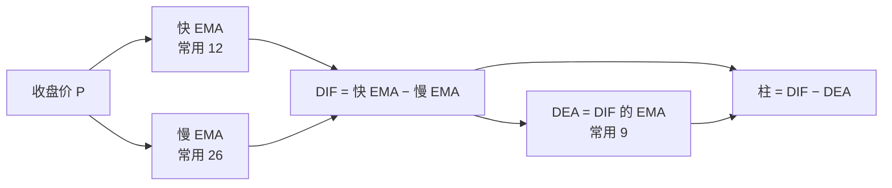
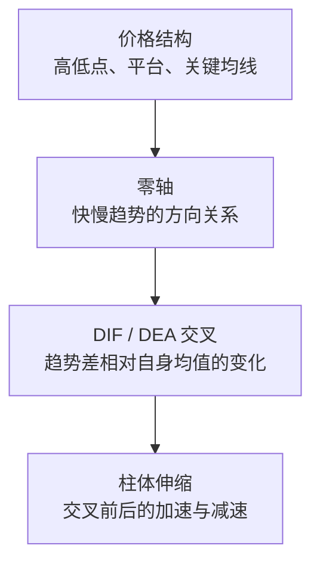
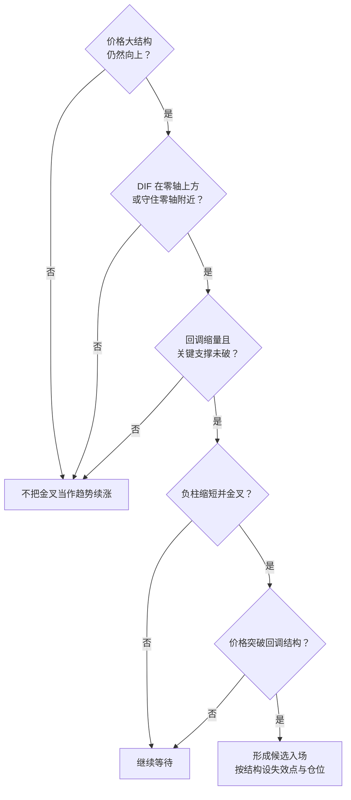

# 两只潮汐钟为何能看见趋势的呼吸？


*图：AI 生成的概念配图。快慢潮汐钟对应两条不同速度的 EMA，中间的距离观测、二次平滑装置和伸缩柱体对应 MACD 的三层计算。*

## 先讲一个故事：海港里的两只潮汐钟

旧港口有两只潮汐钟。

第一只钟很轻。浪头刚刚抬高，它的指针就跟着上扬；浪头突然落下，它也迅速回头。港里的年轻水手喜欢看它，因为它最早察觉变化，但风吹来的一阵碎浪也会让它忙个不停。

第二只钟很重。它不会为一两次浪花改变方向，只有海水持续升高或降低，指针才慢慢移动。老船长信任它，因为它能过滤噪声，但等它确认涨潮，浅滩上的水往往已经涨了一段。

守塔人没有选择其中一只。他每天记录两根指针之间的距离：

- 轻钟跑到重钟上方，说明近期水位比更久以前的基准更高；
- 两针越分越开，说明这股变化正在扩张；
- 两针重新靠近，说明原来的力量正在减弱；
- 轻钟落到重钟下方，说明近期水位已经弱于较慢的基准。

但两根指针的距离也会抖动。守塔人于是又造了一只小小的“回声钟”：它不直接读取海水，只把最近几天的“两针距离”重新平滑一次。真实距离跑到回声钟上方，说明距离比自己的近期常态扩张得更快；落到回声钟下方，说明扩张正在降温，或者收缩正在加速。

最后，他把“真实距离减去回声距离”画成一排柱子。柱子在零线上方变长时，涨潮的优势正在加速；柱子仍在零线上方但开始缩短时，水位或许还在涨，只是涨得没之前快。柱子跌到零线下方，也不保证退潮会持续，因为港湾无风时，两只钟可能在同一位置附近反复交叉。

有一天，一名学徒看到第一根缩短的正柱，立刻命令所有船只返港。老船长制止了他：

> 柱子变短，只说明两种速度之间的优势在收窄，不等于海水已经转向。先看海面是否跌破航道，看风是否改变，再决定是否返航。

这个故事里的轻钟、重钟、回声钟和柱子，合在一起就是 **MACD（Moving Average Convergence/Divergence，指数平滑异同移动平均线）**。

## 寓言与指标的对应关系

| 故事要素 | MACD 中的对应物 | 它回答的问题 |
| --- | --- | --- |
| 轻潮汐钟 | 短周期 EMA，常用 12 | 近期价格重心在哪里？ |
| 重潮汐钟 | 长周期 EMA，常用 26 | 较慢的价格基准在哪里？ |
| 两针距离 | DIF / MACD Line | 快慢趋势相差多少？ |
| 回声钟 | DIF 的 9 周期 EMA，即 DEA / Signal Line | 当前差值相对自己的近期常态如何？ |
| 柱子 | DIF 与 DEA 的差 | 两种趋势之差正在扩张还是收缩？ |
| 港湾、风与航道 | 市场结构、波动、成交量与基本面 | 指标信号是否有可交易的环境？ |

这个类比有边界：真实价格不是潮水，交易者的行为还会反过来影响价格；MACD 只使用价格序列，不知道成交量、新闻、估值、流动性和你的持仓成本。

## MACD 从哪里来？

MACD 通常被认为由美国技术分析师 Gerald Appel 在 20 世纪 70 年代后期提出。公开资料对精确年份的说法并不完全一致，因此比起断言某一个年份，更稳妥的表述是“70 年代后期”。最初的核心是快慢 EMA 之差与它的信号线；Thomas Aspray 在 1986 年发展出 MACD 柱状图，用两条线之间的距离更早地观察交叉的逼近。

这段历史也解释了 MACD 为什么像“两层指标”：

1. 第一层把两条不同速度的趋势线相减，得到快慢趋势的相对强弱。
2. 第二层再对这个差值做指数平滑，观察“趋势差”本身是在加速还是减速。



## 公式不难，关键是理解每一步为什么存在

### 第一步：EMA 不是“只看最近 N 根”

`N` 周期 EMA 的递推公式是：

```text
EMAₜ = α × Pₜ + (1 − α) × EMAₜ₋₁
α = 2 / (N + 1)
```

其中 `Pₜ` 通常是当前收盘价。常用参数下：

```text
EMA12 的 α = 2 / 13 ≈ 15.38%
EMA26 的 α = 2 / 27 ≈ 7.41%
```

所以同一次价格变化进入 EMA12 的即时权重更大，EMA12 反应更快；EMA26 的即时权重更小，反应更慢。

一个常见误解是“EMA12 就是只平均最近 12 根 K 线”。严格说不是。只要历史足够长，EMA 会保留更早数据的指数衰减影响；`12` 和 `26` 主要决定平滑速度，而不是硬切掉第 13 根或第 27 根以前的数据。

### 第二步：用相减去掉两条线共有的慢背景

国际软件常把主线写成 `MACD Line`，国内软件通常叫 `DIF`：

```text
DIFₜ = EMA12ₜ − EMA26ₜ
```

它的含义非常直接：

- `DIF > 0`：快线在慢线上方，近期价格重心高于较慢基准；
- `DIF < 0`：快线在慢线下方，近期价格重心低于较慢基准；
- `DIF` 远离零轴：两条均线正在分离；
- `DIF` 回到零轴：两条均线重新靠拢；
- `DIF = 0`：EMA12 与 EMA26 正好相等。

因此，**DIF 上穿零轴和 EMA12 上穿 EMA26 是同一件事的两种画法**。

从信号处理角度看，两条低通平滑线相减，会削弱它们共有的慢变化，并保留某一段频率范围内的变化。通俗地说，MACD 试图从“价格位置”中提炼“近期趋势相对长期趋势的变化”。但它不是严格的瞬时速度计，也不能无损预测未来。

### 第三步：再对 DIF 平滑一次

国内软件常把信号线叫 `DEA`，国际软件叫 `Signal Line`：

```text
DEAₜ = EMA9(DIFₜ)
```

为什么还要多做一次平滑？因为 DIF 本身仍会抖动。DEA 是 DIF 的较慢参照：

- DIF 上穿 DEA：当前趋势差强于它自己的近期平均；
- DIF 下穿 DEA：当前趋势差弱于它自己的近期平均。

所以所谓“金叉、死叉”，不是神秘的买卖开关，而是**一个经过平滑的差值，穿越了它自己的平滑平均**。

### 第四步：柱子只是把两线距离画得更直观

国际常见定义：

```text
Histogramₜ = DIFₜ − DEAₜ
```

不少国内行情软件使用：

```text
MACD 柱ₜ = 2 × (DIFₜ − DEAₜ)
```

两者只差一个倍数，零轴、交叉时点和正负方向完全相同，但柱高数值不同。比较不同软件截图或复盘数值前，必须先确认平台定义。

柱子的核心读法是：

| 柱子状态 | 数学含义 | 更准确的人话 |
| --- | --- | --- |
| 零线上方且变长 | DIF > DEA，差值继续扩大 | 上行动能优势在增强 |
| 零线上方但缩短 | DIF > DEA，但两者距离缩小 | 仍偏多，但优势在降温 |
| 跌破零轴 | DIF 下穿 DEA | 短期动能关系转弱 |
| 零线下方且变长 | DIF < DEA，负差扩大 | 下行动能优势在增强 |
| 零线下方但缩短 | DIF < DEA，负差收窄 | 仍偏空，但跌势在减速 |

最重要的一句是：**红柱缩短不等于价格必跌，绿柱缩短也不等于价格必涨。** 它们先描述“动能差的变化”，价格方向还要看 DIF 位于零轴哪侧以及价格结构。

## 三组信号其实在看三个不同层次



### 1. 零轴：偏趋势、较慢

零轴回答“快趋势在线上还是线下”。它确认更慢，也更适合做环境过滤：

- 零轴上方：优先把信号理解为多头环境中的加速、降温或回踩；
- 零轴下方：优先把信号理解为空头环境中的加速、降温或反弹；
- 反复穿越零轴：通常说明缺少持续趋势。

### 2. DIF 与 DEA 交叉：偏节奏、中等速度

同一个金叉，位置不同，语境不同：

| 信号 | 常见语境 | 不能直接推出 |
| --- | --- | --- |
| 零轴上金叉 | 上升趋势回踩后再加速 | 一定创新高 |
| 零轴下金叉 | 下跌动能减弱、可能反弹 | 长期趋势已经反转 |
| 零轴上死叉 | 上涨降温或进入回撤 | 必须立刻清仓 |
| 零轴下死叉 | 弱势反弹结束或下跌续弱 | 可以不设止损地追空 |

### 3. 柱体伸缩：偏动能、较快

柱体比两线交叉更早显示两者在靠近，但“更早”也意味着“更容易误报”。它适合提醒你检查价格，而不适合单独触发交易。

可以把三者的速度理解为：

```text
柱体伸缩提醒最快
  → DIF/DEA 交叉居中
  → DIF 穿越零轴确认最慢
```

越快的信号通常噪声越多；越慢的信号通常确认更充分，但入场更晚。这不是指标缺陷，而是过滤噪声必须付出的代价。

## 实际应用一：用零轴过滤市场环境

最朴素的用法不是追每一次金叉，而是先判断 MACD 长时间处于零轴哪一侧。

例如，日线 DIF 在零轴上方、价格保持更高高点与更高低点时，把零轴附近的回踩理解为趋势整理更合理；如果 DIF 长期在零轴下方，价格也不断创出更低低点，那么一次零轴下金叉更可能只是反弹。

零轴必须和结构一起看。指标位于零轴上方但价格已经放量跌破关键平台，不能只因为“MACD 还没翻绿”就否认破位，因为 MACD 天生滞后。

## 实际应用二：寻找趋势中的二次启动

一个比“见金叉就买”更完整的多头观察模板是：

1. 大级别价格结构仍为上升趋势；
2. DIF 位于零轴上方，或回踩零轴附近但没有持续跌入弱区；
3. 回调时成交量收缩，关键支撑没有被有效跌破；
4. 负柱缩短，随后 DIF 再次上穿 DEA；
5. 价格同时突破回调小平台，才把指标信号视为得到确认；
6. 失效点放在价格结构下方，而不是放在某一根柱子的颜色上。



空头场景可以对称理解，但实际交易还要考虑市场是否允许做空、借券成本、轧空风险和隔夜跳空。

## 实际应用三：把背离当预警，不当判决

### 顶背离

价格创出更高高点，但 DIF 或柱体高点低于前高，说明价格仍在上涨，快慢趋势之间的优势却没有同步扩大。它提示上涨动能减弱。

### 底背离

价格创出更低低点，但 DIF 或柱体低点高于前低，说明价格仍弱，下降动能却没有继续恶化。它提示下跌可能接近衰竭。

背离不是反转的充分条件。强趋势里可以连续出现多次背离，价格仍沿原方向运行。更可执行的处理是：

```text
背离出现
  → 降低对原趋势继续加速的预期
  → 等价格破坏原结构或突破反向结构
  → 再决定减仓、退出或反向参与
```

画背离时还要保持口径一致：价格高点对 MACD 高点，价格低点对 MACD 低点；不要为了得到想要的结论，任意挑两个不对应的点。

## 实际应用四：用多周期分工，而不是堆信号

一种常见分工是：

- 周线判断主要趋势和大环境；
- 日线寻找回踩、背离和零轴状态；
- 小时级别寻找具体触发与失效点。

如果周线仍在零轴下方、日线刚刚金叉、小时线已经多次加速，正确描述往往是“大级别弱势中的中级反弹”，而不是把三个周期的信号相加后宣布“超级看多”。

多周期分析的重点是明确谁负责方向、谁负责入场、谁负责退出，避免在交易不顺时临时切换周期为持仓找理由。

## 参数 12、26、9 为什么不是魔法数字？

`12、26、9` 是历史形成并被广泛采用的默认参数，不是自然定律。它们表达的只是三种相对速度：

- `12`：较快的价格平滑；
- `26`：较慢的价格平滑；
- `9`：对快慢差值再平滑。

参数缩短，指标更灵敏，信号更多、假信号也更多；参数拉长，指标更平稳，确认更慢、可能错过早段行情。

| 调整方向 | 典型效果 | 代价 |
| --- | --- | --- |
| 快慢周期都缩短 | 更早响应短期变化 | 震荡中更容易反复交叉 |
| 快慢周期都拉长 | 更重视持续趋势 | 信号明显滞后 |
| 快慢周期差距拉大 | DIF 波动幅度可能变大 | 对短促变化不敏感 |
| Signal 周期缩短 | 金叉死叉更早 | 柱体更容易翻色 |
| Signal 周期拉长 | 信号线更平滑 | 转折确认更晚 |

更换参数前，应先定义交易周期、资产类型和成本，再用足够长、包含趋势与震荡阶段的数据做样本外检验。不要在一段历史图上不断调参，直到每个拐点都“看起来正确”。

## 一个简化算例：不要只背金叉

假设某天：

```text
EMA12 = 103
EMA26 = 100
DIF = 103 − 100 = 3
DEA = 2.4
国际定义的柱 = 3 − 2.4 = 0.6
国内双倍柱 = 2 × 0.6 = 1.2
```

第二天价格仍上涨，但得到：

```text
DIF = 3.1
DEA = 2.7
柱 = 0.4
```

价格上涨、DIF 也上涨，但柱从 `0.6` 缩到 `0.4`。这并不矛盾：快慢均线差仍在扩大，只是 DIF 相对自身信号线的领先幅度缩小了。也就是“仍在前进，但加速度下降”。此时更合理的动作是检查价格是否滞涨、是否接近压力、成交量是否异常，而不是仅凭柱子缩短就断言反转。

## MACD 最容易失灵的地方

### 1. 震荡市

价格没有持续方向时，快慢 EMA 会反复缠绕，金叉死叉连续出现。Fidelity 和 StockCharts 的教学资料都明确提醒，交易区间里 MACD 容易产生来回打脸的信号。

### 2. 突发跳空与消息行情

MACD 只从已经发生的价格计算，不会提前知道财报、政策、事故或流动性冲击。跳空出现后，指标只是被动追赶。

### 3. 把柱体颜色当成涨跌预测

柱体描述的是 DIF 和 DEA 的关系，不是下一根 K 线的颜色。正柱可以伴随价格回调，负柱也可以伴随价格反弹。

### 4. 把背离当作必然反转

强趋势可以“背离之后继续背离”。没有结构确认、仓位纪律和失效条件，背离只是故事。

### 5. 跨股票直接比较 MACD 数值

传统 MACD 是两条均线的绝对价差，带有价格单位。1000 元股票的 MACD 绝对值天然可能大于 10 元股票，因此不能据此判断前者“动能更强”。跨资产比较更适合使用按价格比例标准化的 PPO，或先做其他标准化处理。

### 6. 忽略计算口径

不同平台可能在 EMA 初始值、复权方式、盘中未收盘 K 线、柱体倍数和数据源上存在差异。复盘时要优先比较方向和时点，并确认设置一致。

## 一套可以直接使用的 MACD 检查表

看到信号后，按顺序问：

- 当前是趋势、震荡，还是事件驱动行情？
- 价格高低点结构是否支持 MACD 给出的方向？
- DIF 在零轴上还是零轴下？
- 这是零轴上金叉、零轴下金叉，还是反复缠绕？
- 柱体变化代表优势增强、优势减弱，还是已经换边？
- 信号发生在收盘后，还是未完成 K 线的盘中变化？
- 成交量、关键支撑/阻力和更大周期是否确认？
- 如果判断错了，哪一个价格结构证明失效？
- 交易成本、滑点和仓位是否允许执行？

只要前面几项互相冲突，就不应该因为一个漂亮的金叉强行下结论。

## 最后把 MACD 压缩成三句话

1. **DIF 是快 EMA 减慢 EMA**：它看近期趋势相对较慢趋势的方向和距离。
2. **DEA 是 DIF 的 EMA**：它给“趋势差”再建立一条慢基准。
3. **柱体是 DIF 减 DEA**：它看趋势差相对自身基准的扩张与收缩。

MACD 的真正价值不是预测每个拐点，而是把“趋势方向、趋势差和动能变化”放进同一个框架。用它先识别环境，再等待价格结构确认，远比机械执行金叉死叉可靠。

## 参考来源

- [StockCharts ChartSchool：MACD](https://chartschool.stockcharts.com/table-of-contents/technical-indicators-and-overlays/technical-indicators/macd-moving-average-convergence-divergence-oscillator)：用于核对 Gerald Appel 的历史归属、12/26/9 公式、零轴、交叉、背离，以及震荡市假信号和跨资产数值不可直接比较等边界。
- [Fidelity：MACD 指标指南](https://www.fidelity.com/learning-center/trading-investing/technical-analysis/technical-indicator-guide/macd)：用于核对 MACD 的趋势动量定位、计算方式和区间震荡中的反复交叉风险。
- [MathWorks：MACD](https://www.mathworks.com/help/finance/macd.html)：用于交叉核对快慢 EMA 相减的计算定义。
- [IFTA Journal 2023](https://www.ifta.org/assets/docs/journal_23.pdf)：用于核对 Thomas Aspray 于 1986 年发展 MACD Histogram 的历史说明。不同资料可能采用相反的柱体符号方向，本文采用当前国际图表软件更常见的 `DIF − DEA` 口径，并单独说明国内常见的双倍柱。

仅供学习，不构成投资建议。
